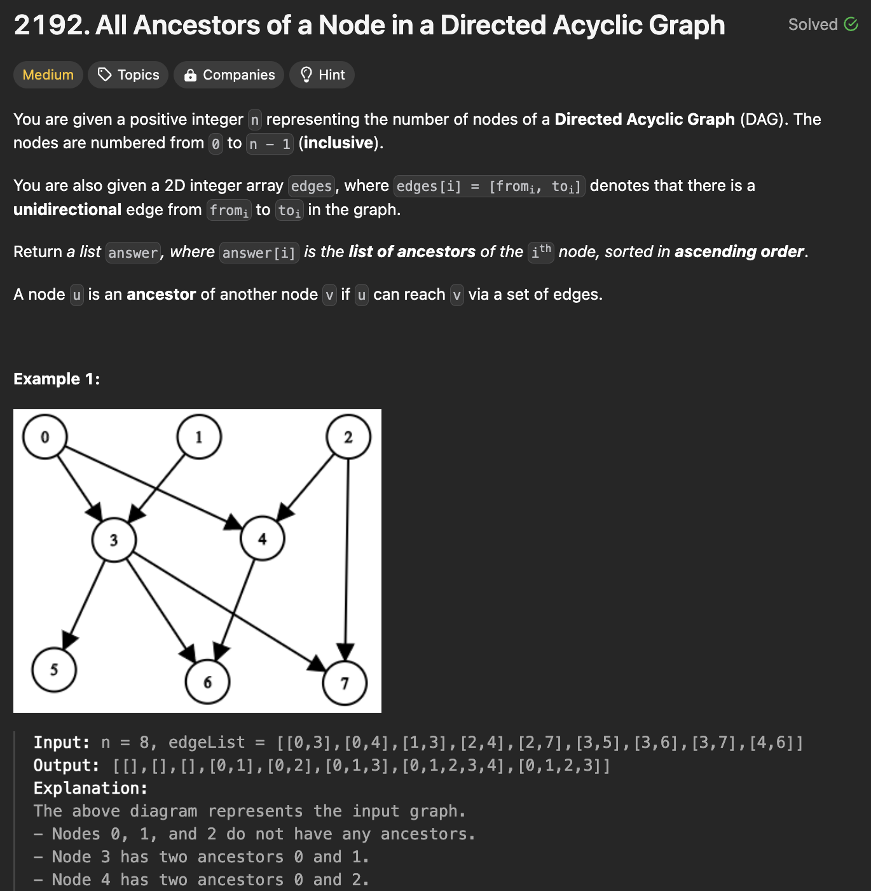
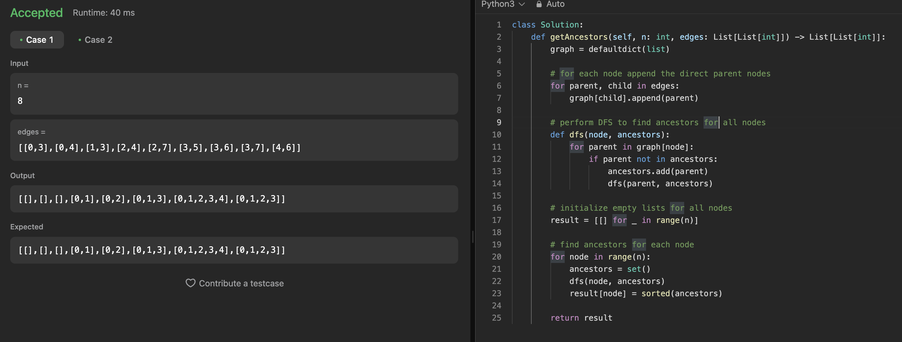

# 문제 설명
이 문제는 DAG에서 모든 조상을 찾는 문제입니다. 입력 값으로는 노드의 수 n, 간선 정보 edges가 주어집니다. 주어진 간선 정보를 통해 모든 노드의 조상을 찾는 문제입니다.



## 풀이 및 해설



## 풀이
```python
class Solution:
    def getAncestors(self, n: int, edges: List[List[int]]) -> List[List[int]]:
        graph = defaultdict(list)

        # for each node append the direct parent nodes
        for parent, child in edges:
            graph[child].append(parent)

        # perform DFS to find ancestors for all nodes
        def dfs(node, ancestors):
            for parent in graph[node]:
                if parent not in ancestors:
                    ancestors.add(parent)
                    dfs(parent, ancestors)
        
        # initialize empty lists for all nodes
        result = [[] for _ in range(n)]

        # find ancestors for each node
        for node in range(n):
            ancestors = set()
            dfs(node, ancestors)
            result[node] = sorted(ancestors)

        return result
```
- defaultdict를 사용하여 그래프를 생성합니다.
- 각 노드의 부모 노드를 추가합니다.
- DFS를 사용하여 모든 노드의 조상을 찾습니다.
- 모든 노드의 조상을 찾아서 정렬하여 반환합니다.

## Complexity Analysis


### 시간 복잡도
- 각 노드에 대해 부모 노드를 추가하는 데 O(n)이 소요됩니다.
- DFS를 사용하여 모든 노드의 조상을 찾는 데 O(n)이 소요됩니다.

따라서 전체 시간 복잡도는 O(n^2)입니다.

### 공간 복잡도
- 그래프를 저장하는 데 O(n)이 소요됩니다.
- 모든 노드의 조상을 저장하는 데 O(n)이 소요됩니다.

따라서 전체 공간 복잡도는 O(n)입니다.

## Constraint Analysis
```
Constraints:
1 <= n <= 1000
0 <= edges.length <= min(2000, n * (n - 1) / 2)
edges[i].length == 2
0 <= from_i, to_i <= n - 1
from_i != to_i
There are no duplicate edges.
The graph is directed and acyclic.
```

# References
- [LeetCode](https://leetcode.com/problems/all-ancestors-of-a-node-in-a-directed-acyclic-graph/)