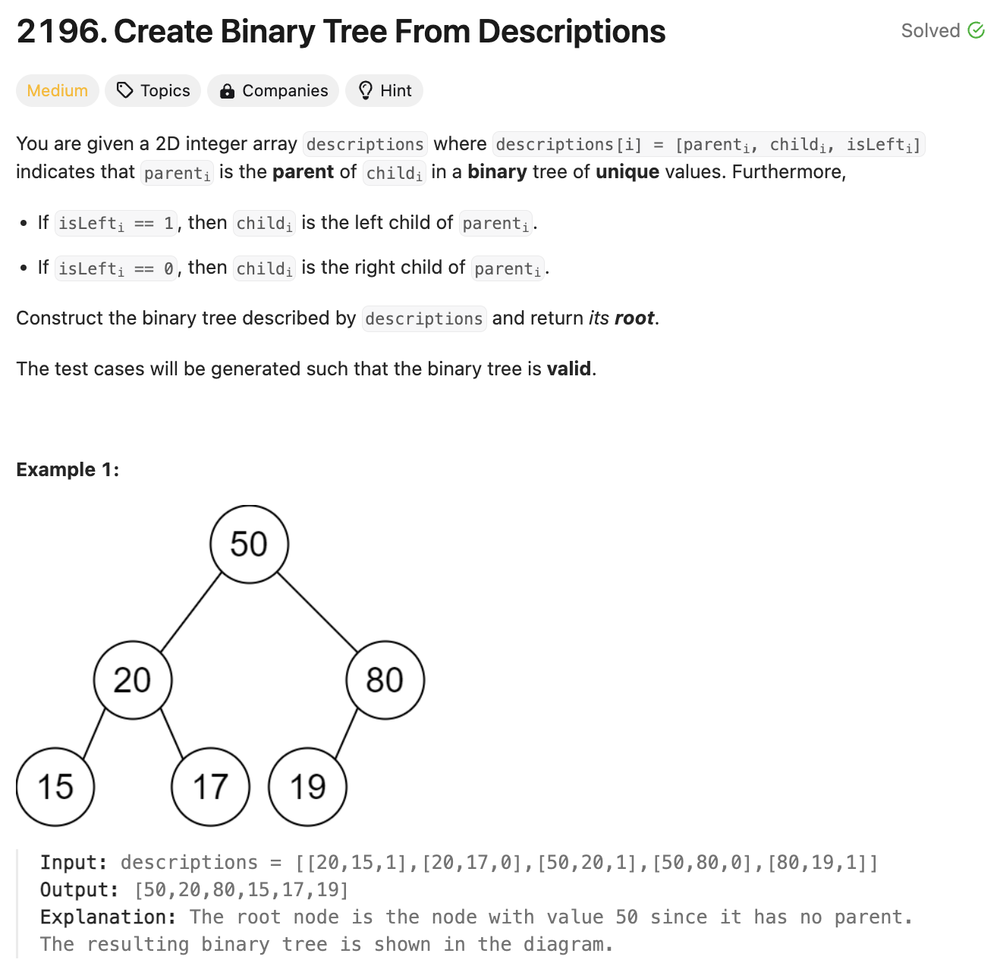

# 문제 설명
자식 노드와 부모 노드의 관계를 알려주는 배열이 주어졌을 때, 트리를 만들어서 출력하는 문제다.



## 풀이 및 해설
해당 문제는 다음 순서로 풀 수 있다.  
1. dictionary를 만든다.
2. 부모 노드와 자식 노드를 순회하면서 추가하고 트리를 만든다.
3. 루트 노드를 찾아서 반환한다.

## 풀이
```python
def createBinaryTree(self, descriptions: List[List[int]]) -> Optional[TreeNode]:
        # 1. create dictionary
        nodes = {}
        children = set()
        # 2. iterate through nodes and set children
        for parent, child, isleft in descriptions:
            if parent not in nodes:
                nodes[parent] = TreeNode(parent)
            if child not in nodes:
                nodes[child] = TreeNode(child)
            
            if isleft:
                nodes[parent].left = nodes[child]
            else:
                nodes[parent].right = nodes[child]

            children.add(child)

        # 3. find root (no parent)
        for node in nodes:
            if node not in children:
                return nodes[node]
        
        return None
```

## Complexity Analysis


### 시간 복잡도
- O(N) : 노드의 개수만큼 순회하므로 O(N)이다.

### 공간 복잡도
- O(N) : 노드의 개수만큼 dictionary를 만들어야 하므로 O(N)이다.

## Constraint Analysis
```
Constraints:
1 <= descriptions.length <= 10^4
descriptions[i].length == 3
1 <= parenti, childi <= 10^5
0 <= isLefti <= 1
The binary tree described by descriptions is valid.
```

# References
- [2196. Create Binary Tree From Descriptions](https://leetcode.com/problems/create-binary-tree-from-descriptions/)