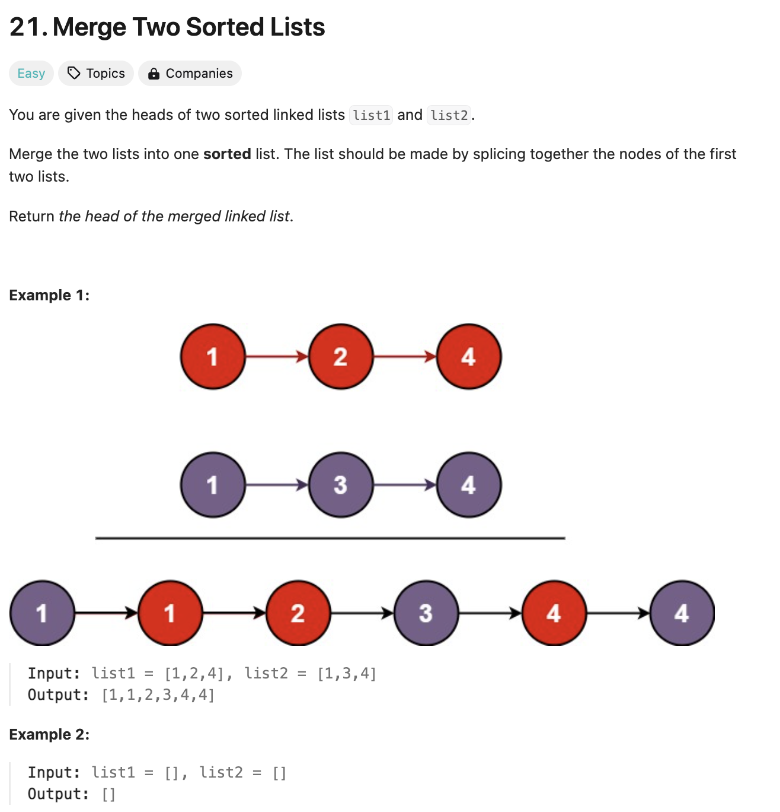
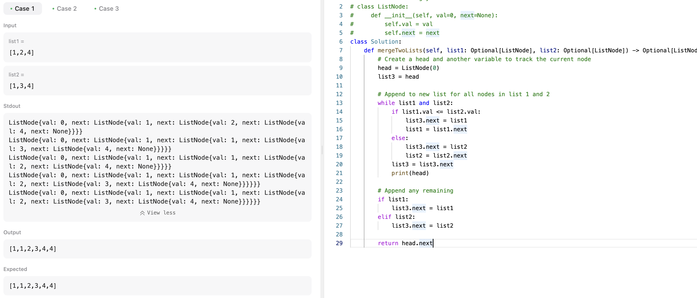

# 문제 설명
두개의 배열이 주어지면 두개를 합치면 된다.



이렇게만 보면 진짜 간단해 보인다. 그냥 두개를 합치고 정렬하면 되지 않나? 제약사항을 유심히 살펴봐야 할 것 같다.


## 풀이 및 해설


생긴것보다는 어려웠다. 보니까 가장 첫 노드를 잃지 않는게 핵심이었고, 배열을 합치고 정렬하고 끝낼 수가 없는게, 두개의 배열이 노드로 구성되어 있어서 안됐다.

그래도 다음과 같이 하니까 머리의 위치를 기록하면 해결이 됐다.

```python
# Create a head and another variable to track the current node
head = ListNode(0)
list3 = head
```

## 풀이
```python
def mergeTwoLists(self, list1: Optional[ListNode], list2: Optional[ListNode]) -> Optional[ListNode]:
        # Create a head and another variable to track the current node
        head = ListNode(0)
        list3 = head

        # Append to new list for all nodes in list 1 and 2
        while list1 and list2:
            if list1.val <= list2.val:
                list3.next = list1
                list1 = list1.next
            else:
                list3.next = list2
                list2 = list2.next
            list3 = list3.next
            print(head)
            
        # Append any remaining
        if list1:
            list3.next = list1
        elif list2:
            list3.next = list2

        return head.next
```

- 먼저, head와 list3를 생성한다.
- list1과 list2의 노드들을 모두 새로운 리스트에 추가한다.
- list1과 list2의 노드들을 비교해서 작은 값을 list3에 추가한다.
- list3를 다음 노드로 이동한다.
- list1과 list2 중 남은 노드들을 추가한다.
- head의 다음 노드를 반환한다.

## Complexity Analysis


### 시간 복잡도
두 리스트를 한 번씩 순회하므로 O(N + M)이다. 여기서 N과 M은 각각 list1과 list2의 노드 수이다.
각 노드를 정확히 한 번 방문하고, 상수 시간 연산만 수행하므로, 전체 시간 복잡도는 O(N + M)이다.

### 공간 복잡도
O(1); 새로운 노드를 생성하지 않고 기존 노드들을 재배열하므로 추가 공간이 필요하지 않다.
단, 함수 호출 스택을 고려하면 O(1)의 추가 공간만 사용된다.

## Constraint Analysis
```
Constraints:
The number of nodes in both lists is in the range [0, 50].
-100 <= Node.val <= 100
Both list1 and list2 are sorted in non-decreasing order.
```
노드의 수가 최대 50개로 매우 작기 때문에 O(N + M) 복잡도의 알고리즘은 충분히 빠르게 실행될 수 있다.
현재 프로그램이 비효율적인 이유는 불필요한 ListNode 객체 생성과 list3 변수의 재할당 때문이다. 더미 노드를 사용하여 헤드를 유지하고, 포인터를 이동시키며 기존 노드들을 연결하는 방식으로 개선할 수 있다. 또한, 두 리스트가 이미 정렬되어 있다는 점을 활용하여 단순히 값을 비교하며 병합하는 것이 가능하다. 이러한 최적화를 통해 작은 크기의 입력에서도 효율적으로 동작할 수 있다.

# References
- [LeetCode](https://leetcode.com/problems/merge-two-sorted-lists/)