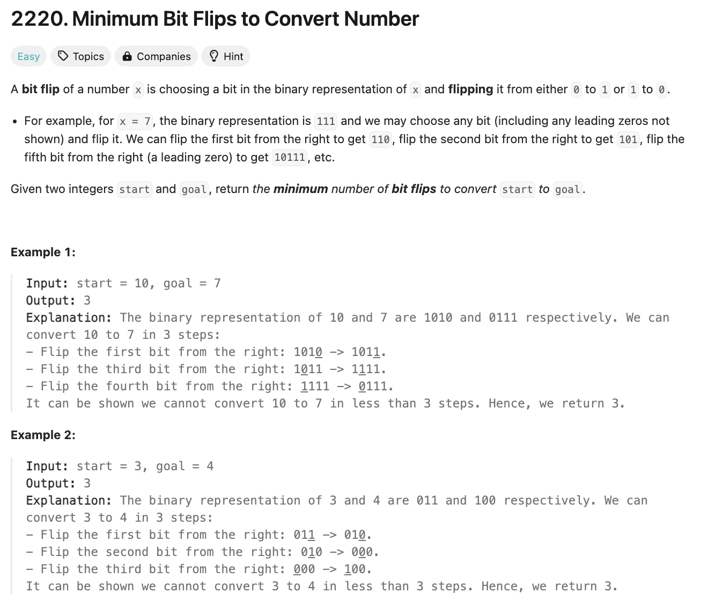
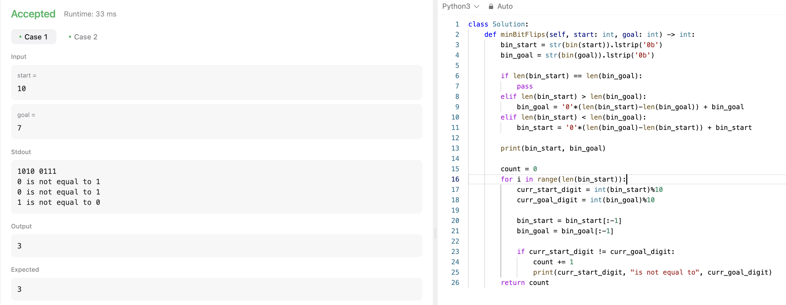

# 문제 설명
이진법으로 표현된 두 숫자가 주어졌을 때, 같게 만들기 위해 몇개의 비트를 바꿔야 하는지 구하는 문제다.




## 풀이 및 해설


## 풀이
```python
def minBitFlips(self, start: int, goal: int) -> int:
    bin_start = str(bin(start)).lstrip('0b')
    bin_goal = str(bin(goal)).lstrip('0b')

    if len(bin_start) == len(bin_goal):
        pass
    elif len(bin_start) > len(bin_goal):
        bin_goal = '0'*(len(bin_start)-len(bin_goal)) + bin_goal
    elif len(bin_start) < len(bin_goal):
        bin_start = '0'*(len(bin_goal)-len(bin_start)) + bin_start

    count = 0
    for i in range(len(bin_start)):
        curr_start_digit = int(bin_start)%10
        curr_goal_digit = int(bin_goal)%10

        bin_start = bin_start[:-1]
        bin_goal = bin_goal[:-1]

        if curr_start_digit != curr_goal_digit:
            count += 1
    return count
```

## Complexity Analysis


### 시간 복잡도
O(N) where N is the number of bits in the binary representation of the input numbers.

### 공간 복잡도
O(1)


# Optimization
이 코드를 더 빠르고 간격하게 풀기 위해서는 XOR 연산을 사용하면 된다.   
길고 복잡했던 코드를 두 줄로 줄일 수 있다.

```python
def minBitFlips(self, start: int, goal: int) -> int:
        xor = start ^ goal
        return bin(xor).count('1')
```


시간 복잡도 또한 상당히 줄어들었다.

## Constraint Analysis
```
Constraints:
0 <= start, goal <= 10^9
```

# References
- [2220. Minimum Bit Flips to Convert Number](https://leetcode.com/problems/minimum-bit-flips-to-make-a-or-b-equal-to-c/)