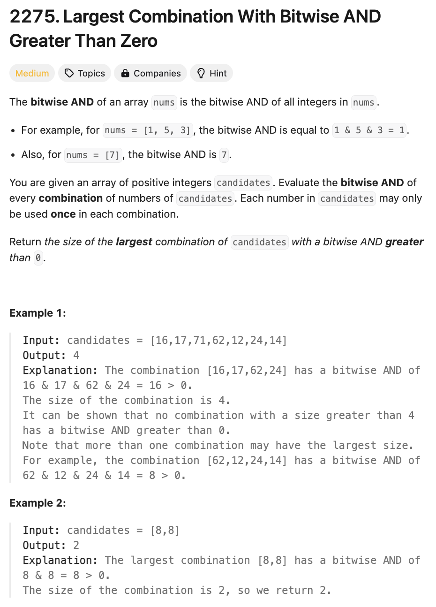

# 문제 설명
배열에서의 bitwise AND는 배열의 모든 숫자들의 AND 연산을 의미한다. 즉, [1,5,3]에서 `1 & 5 & 3 = 1`이 된다.

이때, candidates 배열에서 bitwise AND가 0보다 큰 가장 큰 조합을 찾아라.



## 풀이 및 해설

## 풀이
```python
def largestCombination(self, candidates: List[int]) -> int:
    max_count = 0

    for bit in range(32): # integers 32bit in python
        count = 0
        for num in candidates:
            if num & (1 << bit):
                count += 1
            max_count = max(max_count, count)
    
    return max_count
```
- 32비트 정수를 기준으로 모든 비트를 확인한다.
- 각 비트를 확인하면서 해당 비트가 1인 경우 count를 증가시킨다.
- count의 최대값을 반환한다.

## Complexity Analysis


### 시간 복잡도
- 시간 복잡도는 `O(n*32)`이다. 32비트를 확인하면서 모든 배열을 확인하기 때문이다.

### 공간 복잡도
- 공간 복잡도는 `O(1)`이다. 추가적인 공간이 필요하지 않다.

## Constraint Analysis
```
Constraints:
1 <= candidates.length <= 10^5
1 <= candidates[i] <= 10^7
```

# References
- [2275. Largest Combination With Bitwise AND Greater Than Zero](https://leetcode.com/problems/largest-combination-with-bitwise-and-greater-than-zero/)