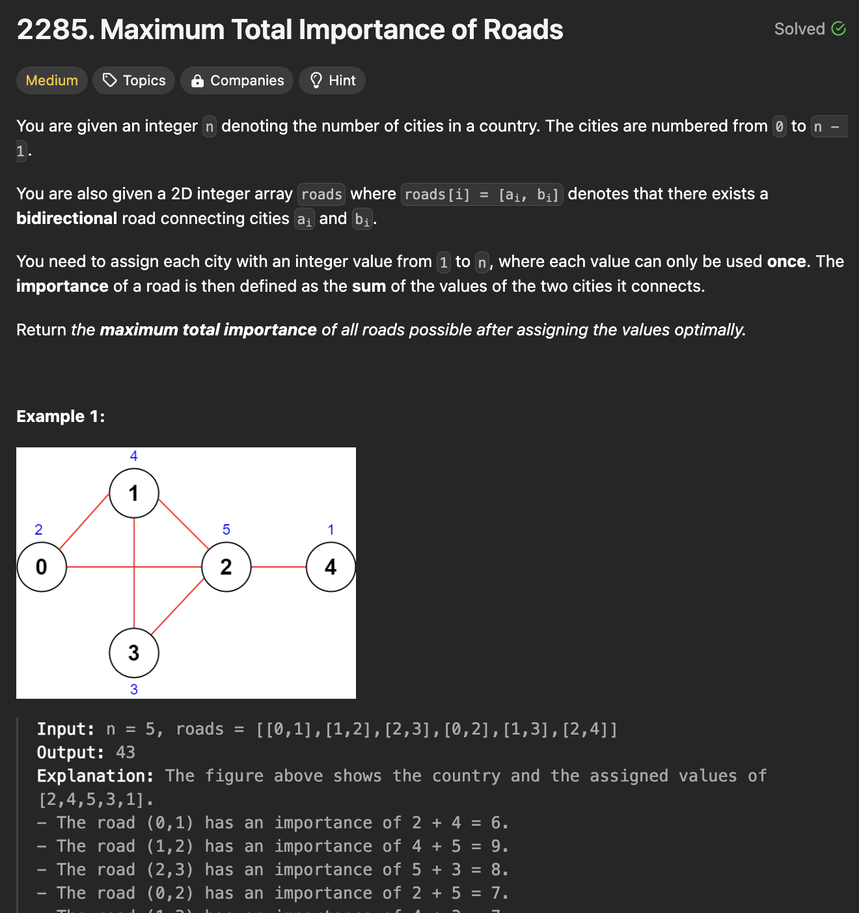

# 문제 설명
이 문제는 도시의 중요도를 최대화하는 문제입니다. 입력 값으로는 도시의 수 n, 도시들 간의 연결 정보 roads가 주어집니다. 주어진 도시들 간의 연결 정보를 통해 도시의 중요도를 최대화하는 방법을 찾는 문제입니다.



## 풀이 및 해설
해당 문제에서 핵심은 도시들의 중요도를 계산하는 것이며, 이를 판단하기 위해 연결 순으로 정렬했습니다. 이후, 역순으로 도시들에 값을 할당하며 계산하면 되는 문제입니다.


## 풀이
```python
class Solution:
    def maximumImportance(self, n: int, roads: List[List[int]]) -> int:
        nodes = defaultdict(int)
        
        # rank the nodes in order of how many connections they have
        for road in roads:
            nodes[road[0]] +=1
            nodes[road[1]] +=1
        
        # sort cities by connection counts
        sorted_cities = sorted(nodes.keys(), key = lambda x: nodes[x], reverse=True)

        # assign values to cities
        values = {}
        current_value = n
        for city in sorted_cities:
            values[city] = current_value
            current_value -= 1

        # assign values to cities not in roads
        for city in range(n):
            if city not in values:
                values[city] = current_value
                current_value -=1

        # calculate total importance
        total_importance = 0
        for a, b in roads:
            total_importance += values[a] + values[b]

        return total_importance
```
- 도시들 간의 연결 정보를 통해 도시들의 중요도를 계산하기 위해 `nodes` 딕셔너리를 만듭니다.
- 도시들의 중요도를 계산하기 위해 도시들 간의 연결 정보를 통해 도시들의 중요도를 계산하고 중요도가 높은 순서대로 정렬합니다.
- 정렬된 도시들에 대해 순차적으로 값을 할당합니다.
- 아무 연결 정보가 없는 도시들에 대해 중요도를 마저 할당합니다.
- 마지막으로, 배정된 값들에 따른 합산 중요도를 계산하여 반환합니다.

## Complexity Analysis


### 시간 복잡도
- 도시들 간의 연결 정보를 통해 도시들의 중요도를 계산하기 위해 O(n)의 시간이 소요됩니다.
- 도시들의 중요도를 계산하기 위해 O(nlogn)의 시간이 소요됩니다.
- 도시들에 중요도를 할당하기 위해 O(n)의 시간이 소요됩니다.
- 중요도를 계산하기 위해 O(n)의 시간이 소요됩니다.

따라서, 최종적으로 O(nlogn)의 시간 복잡도를 가집니다.

### 공간 복잡도
- nodes 딕셔너리를 만드는데 O(n)의 공간이 소요됩니다.
- values 딕셔너리를 만드는데 O(n)의 공간이 소요됩니다.
- total_importance 변수를 만드는데 O(1)의 공간이 소요됩니다.

따라서, 최종적으로 O(n)의 공간 복잡도를 가집니다.

## Constraint Analysis
```
Constraints:
2 <= n <= 5 * 10^4
1 <= roads.length <= 5 * 10^4
roads[i].length == 2
0 <= ai, bi <= n - 1
ai != bi
There are no duplicate roads.
```

# References
- [LeetCode](https://leetcode.com/problems/maximum-total-importance-of-roads/)