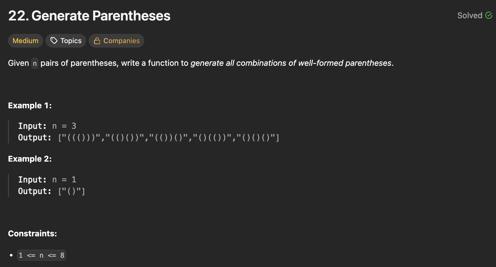

## 문제 설명
n쌍의 괄호가 주어지면 올바른 괄호 조합을 모두 반환하는 문제다.



## 풀이 및 해설
이 문제는 백트래킹(Backtracking) 기법을 사용하여 해결할 수 있습니다. n쌍의 괄호로 만들 수 있는 모든 올바른 조합을 재귀적으로 생성합니다.

- 백트래킹 함수를 정의하여 재귀적으로 가능한 모든 괄호 조합을 생성합니다.
- 기본 사례로, 현재 경로의 길이가 2n이 되면 현재 경로를 결과 리스트에 추가합니다.
- 재귀 단계에서는 여는 괄호 '('와 닫는 괄호 ')'를 추가할 수 있는지 확인하고, 가능한 경우 각각을 경로에 추가하고 재귀적으로 다음 단계를 탐색합니다.
- 최종적으로 모든 가능한 올바른 괄호 조합을 반환합니다.


**핵심**: 기억해야 할 정보를 백트래킹 함수에 전달하여 타겟까지 도달하는 조합을 찾는 것이 중요하다. 이때, 여는 괄호와 닫는 괄호의 개수를 추적하는 것이 중요하다.

```python
class Solution:
    def generateParenthesis(self, n: int) -> List[str]:
        res = []

        def backtrack(open_cnt, close_cnt, path):
            if len(path)==n*2:
                res.append(path[:])
                return
            
            if open_cnt < n:
                backtrack(open_cnt+1, close_cnt, path+"(")
            
            if close_cnt < open_cnt:
                backtrack(open_cnt, close_cnt+1, path+")")

        
        backtrack(0, 0, "")
        return res
```

## 복잡도


### 시간복잡도
- `O(4^n / sqrt(n))` ; n은 괄호 쌍의 개수입니다. 가능한 올바른 괄호 조합의 수는 카탈란 수로 표현되며, 이는 대략적으로 `O(4^n / sqrt(n))`에 해당합니다.

### 공간복잡도
- `O(n)` ; 재귀 호출 스택과 현재 경로를 저장하는 데 사용되는 공간입니다.

## Constraint Analysis
```
Constraints:
1 <= n <= 8
```

# References
- [22. Generate Parentheses - LeetCode](https://leetcode.com/problems/generate-parentheses/)