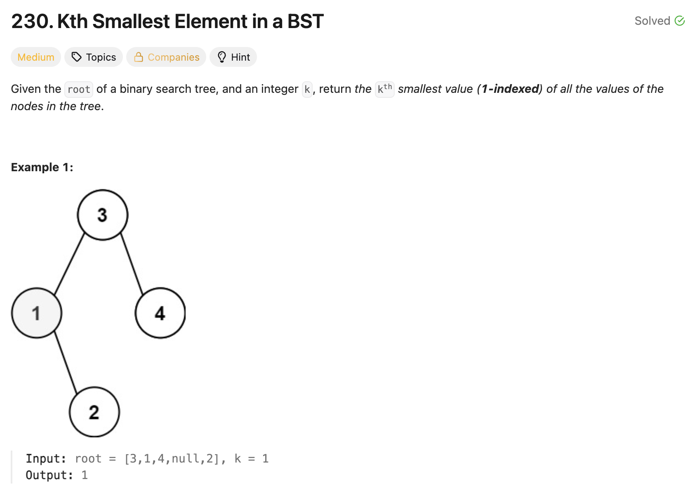

# 문제 설명
이진 탐색 트리에서 k번째로 작은 요소를 찾는 문제다.



## 풀이 및 해설
이 문제 같은 경우에는 이진 탐색 트리의 특성을 이용해서 풀 수 있다. 이진 탐색 트리의 특성상 왼쪽 자식 노드는 부모 노드보다 작고, 오른쪽 자식 노드는 부모 노드보다 크다. 따라서 중위 순회를 통해서 노드 값을 오름차순으로 정렬된 리스트를 얻을 수 있다. 이 리스트에서 k-1 인덱스에 해당하는 값을 반환하면 된다. 주의해야 할 점은 오른쪽 노드가 바로 인접한 부모 노드보다 클 수 있기 때문에 반드시 중위 순회를 통해서 값을 얻어야 한다는 것이다.

## 풀이
```python
# Definition for a binary tree node.
# class TreeNode:
#     def __init__(self, val=0, left=None, right=None):
#         self.val = val
#         self.left = left
#         self.right = right
class Solution:
    def kthSmallest(self, root: Optional[TreeNode], k: int) -> int:
        stack = []
        current = root
        seen = 0
        prev = None
        
        while (stack or current):
            # go to leftmost
            while current:
                stack.append(current)
                current = current.left
            
            # get leftmost
            current = stack.pop()
            seen += 1
            if seen == k:
                return current.val

            # insert right
            prev = current.val
            current = current.right
        
        return current.val
```

## Complexity Analysis


### 시간 복잡도
- O(N)

### 공간 복잡도
- O(H); H는 트리의 높이

## Constraint Analysis
```
Constraints:

The number of nodes in the tree is n.
1 <= k <= n <= 10^4
0 <= Node.val <= 10^4
```

# References
- [230. Kth Smallest Element in a BST - LeetCode](https://leetcode.com/problems/kth-smallest-element-in-a-bst/)