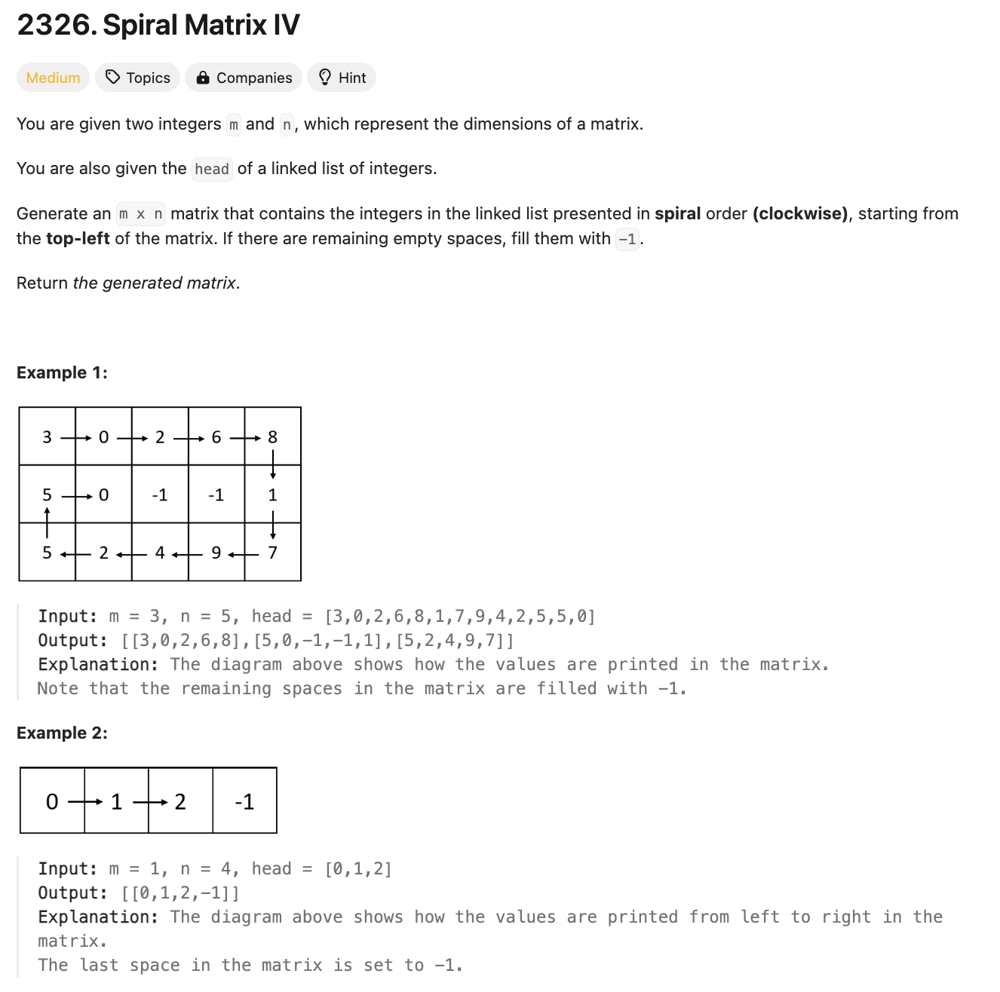
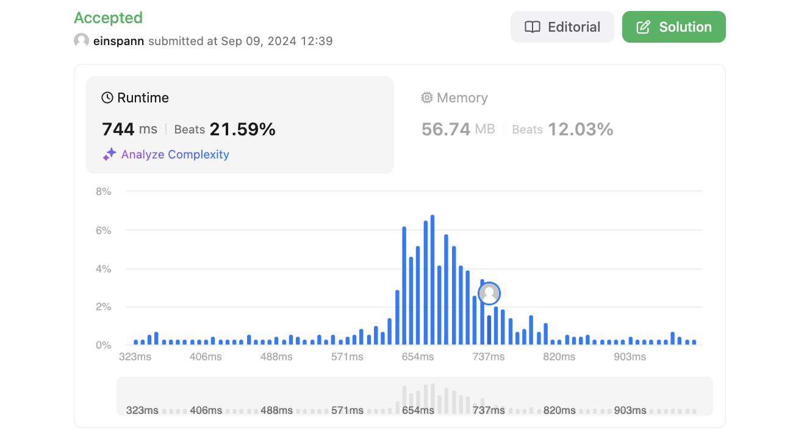

# 문제 설명
링크드 리스트가 주어졌을 때, 이를 나선형으로 순회하여 배열로 반환하는 문제다.



## 풀이 및 해설
상당히 더럽게 풀긴 했는데 일단 성공은 한다. 나중에 한번 최적화 방법을 생각해봐야겠다.

## 풀이
```python
class Solution:
    def spiralMatrix(self, m: int, n: int, head: Optional[ListNode]) -> List[List[int]]:
        length = 0
        c = head
        while c:
            length += 1
            c = c.next
        
        curr = head
        graph = [[-1 for _ in range(n)] for _ in range(m)]
        direction = [(0,1), (1,0), (0,-1), (-1,0)] # clockwise: right, down, left, up
        x,y = 0,0
        curr_dir_index = 0
        curr_dir = direction[0]

        for i in range(length):

            if curr:
                graph[x][y] = curr.val
                curr = curr.next

            check_x = x + curr_dir[0]
            check_y = y + curr_dir[1]
            x_bound = 0
            y_bound = 0
            if check_x >= m+x_bound or check_x < 0: # out of bounds
                curr_dir_index = (curr_dir_index + 1) % 4
                curr_dir = direction[curr_dir_index]
                x_bound -= 1
            elif check_y >= n+y_bound or check_y < 0: # out of bounds
                curr_dir_index = (curr_dir_index + 1) % 4
                curr_dir = direction[curr_dir_index]
                y_bound -= 1
            elif  graph[check_x][check_y] != -1:
                curr_dir_index = (curr_dir_index + 1) % 4
                curr_dir = direction[curr_dir_index]
                if curr_dir[0] == 0:
                    x_bound += 1
                else:
                    y_bound += 1
        
            x = x + curr_dir[0]
            y = y + curr_dir[1]
        return graph
```

## Complexity Analysis


### 시간 복잡도
O(MN) ; M은 행의 길이, N은 열의 길이

MN만큼 반복하게 된다.

### 공간 복잡도
O(MN) ; M은 행의 길이, N은 열의 길이

MN만큼의 공간이 matrix에 할당된다.

## Constraint Analysis
```
Constraints:
1 <= m, n <= 10^5
1 <= m * n <= 10^5
The number of nodes in the list is in the range [1, m * n].
0 <= Node.val <= 1000
```

# References
- [2326. Spiral Matrix IV](https://leetcode.com/problems/spiral-matrix-iv/)