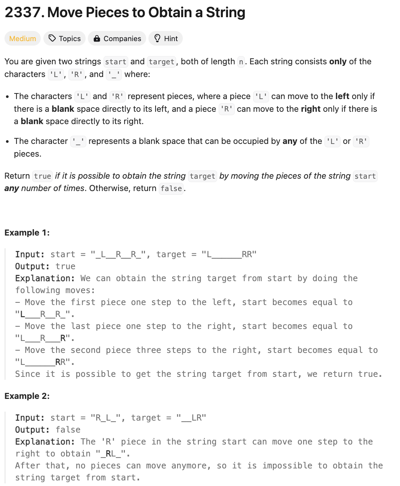

# 문제 설명
이 문제는 'L', 'R', '_'로 이루어진 두 문자열이 주어질 때, 다음 연산을 통해 두 문자열이 똑같아질 수 있는지 확인하는 문제이다.

- 'L' 왼쪽에 '_'가 있다면, 'L'은 왼쪽으로 한 칸 이동
- 'R' 오른쪽에 '_'가 있다면, 'R'은 오른쪽으로 한 칸 이동



## 풀이 및 해설

## 풀이
```python
class Solution:
    def canChange(self, start: str, target: str) -> bool:
        # if order is different return False
        if start.replace('_', '') != target.replace('_', ''):
            return False
        
        n = len(start)
        i = j = 0

        while i < n and j < n:
            # skip underscores at start
            while i < n and start[i] == '_':
                i += 1
            while j < n and target[j] == '_':
                j += 1
            
            # if exhausted, they should both be equal
            if i == n or j == n:
                return i == j
            
            # check if pieces match 
            if (start[i] != target[j]) or \
                (start[i] == 'L' and i < j) or \
                (start[i] == 'R' and i > j):
                return False
            
            i += 1
            j += 1
        
        return True
```

## Complexity Analysis


### 시간 복잡도
- O(N) : N은 문자열의 길이이다.

### 공간 복잡도
- O(1) : 추가적인 공간을 사용하지 않는다.

## Constraint Analysis
```
Constraints:
n == start.length == target.length
1 <= n <= 105
start and target consist of the characters 'L', 'R', and '_'.
```

# References
- [2337. Move Pieces to Obtain a String](https://leetcode.com/problems/move-pieces-to-obtain-a-string/)