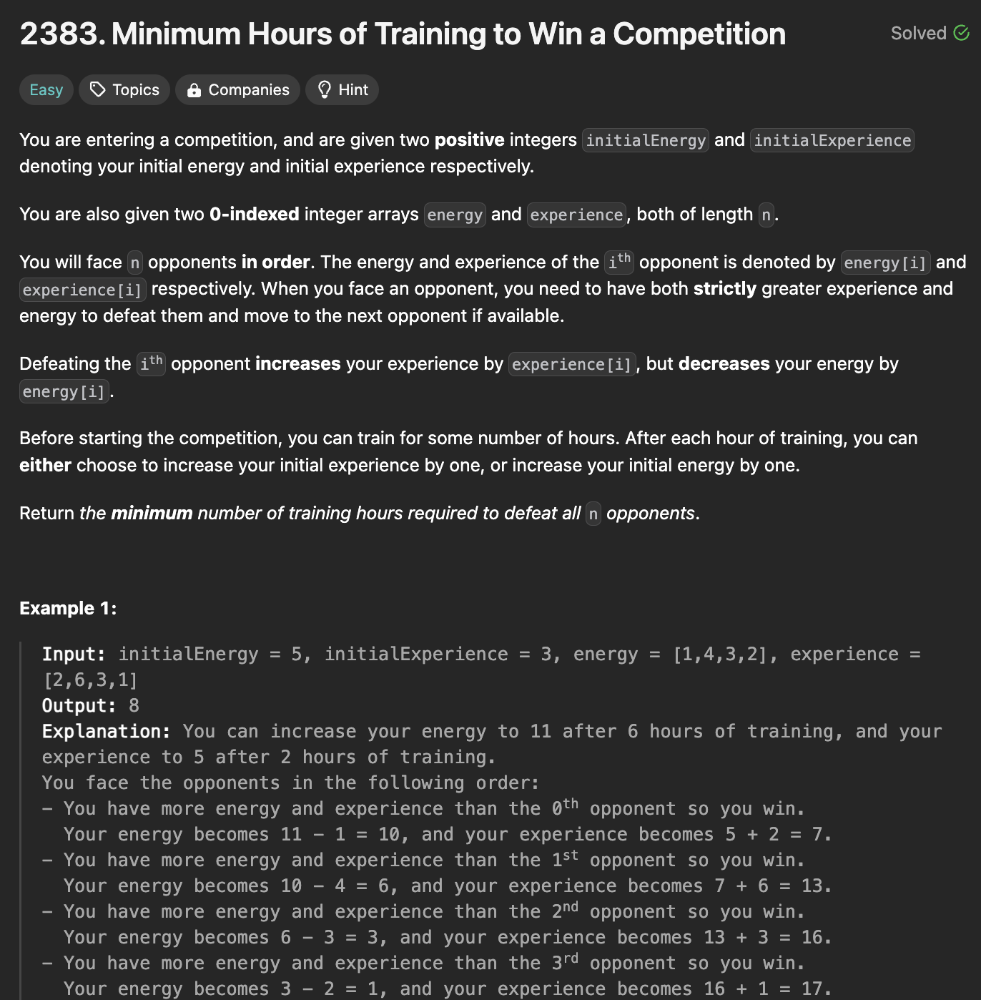
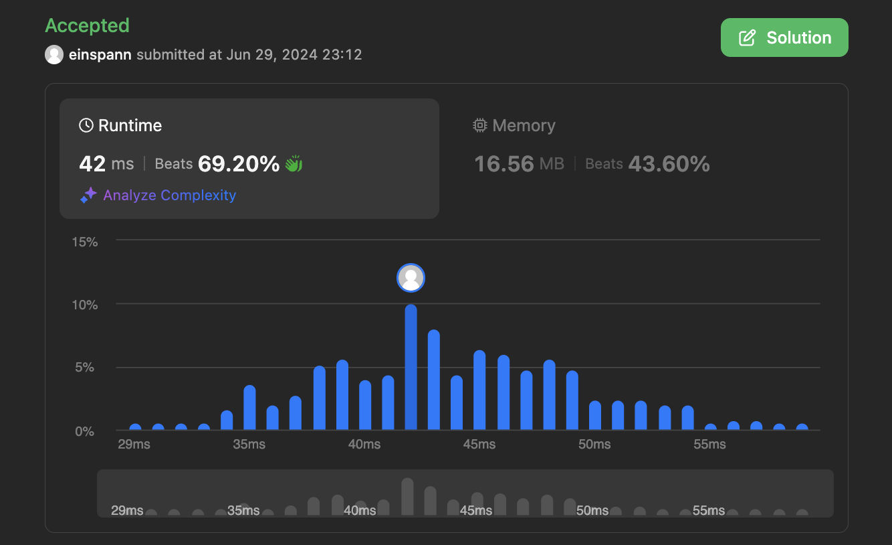

# 문제 설명
대회를 이기기 위해서 최소 몇시간을 훈련해야 하는지 구하는 문제입니다.

주어지는 입력으로는 다음과 같습니다:
- initialEnergy: 초기 에너지
- initialExperience: 초기 경험치
- energy: 상대방들의 에너지 배열
- experience: 상대방들의 경험치 배열



## 풀이 및 해설
이 문제를 풀기 위해서는 크게는, 1) 에너지가 충분한지, 2) 경험이 충분한지를 확인해야 합니다.

이를 확인하기 위해서 다음과 같이 구했습니다.

1) 에너지가 충분한지 확인하기 위해서는 에너지는 매번 줄어들기 때문에, 초기 에너지보다 상대방들의 에너지 합이 크거나 같아야 합니다. 만약, 에너지가 부족하다면, 에너지가 부족한 만큼 훈련을 해야하기 때문에, 에너지가 부족한 만큼을 더해줍니다.

2) 경험이 충분한지 확인하기 위해서는, 경험치가 매번 증가합니다. 따라서, 경험치가 매번 증가함에 따라서 추가로 필요한 경험치를 계산하여, 이 중 최대값을 구합니다. 초기 경험치가 이보다 작다면, 경험이 부족한 만큼을 더해줍니다.


## 풀이
```python
class Solution:
    def minNumberOfHours(self, initialEnergy: int, initialExperience: int, energy: List[int], experience: List[int]) -> int:
        need = 0
        sum_En = sum(energy)
        # check if we have enough energy
        if sum_En >= initialEnergy:
            need = sum_En - initialEnergy + 1
        
        # check how much experience we actually need
        sum_Ex = experience[0]
        for i in range(1, len(experience)):
            temp = sum_Ex + experience[i]
            experience[i] -= sum_Ex
            sum_Ex = temp
        
        max_Ex = max(experience)
        # check if we have enough experience
        if max_Ex >= initialExperience:
            need += max_Ex - initialExperience + 1
        
        return need
```
- need 변수를 초기화합니다.
- 에너지가 충분한지 확인하기 위해서는, 에너지가 부족한 만큼을 더해줍니다.
- 경험이 충분한지 확인하기 위해서는, 경험이 부족한 만큼을 더해줍니다.
- 경험치 배열을 순회하면서, 그 이전까지의 합산 경험치를 빼줍니다.
- 이 중 최대값을 구하여, 초기 경험차와의 차이를 계산합니다.
- 최종적으로, 필요한 에너지와 경험치를 합쳐서 반환합니다.

## Complexity Analysis


### 시간 복잡도
- 에너지의 합을 구하는데 O(n)이 소요됩니다.
- 경험치를 확인하는 데 O(n)이 소요됩니다.

따라서 전체 시간 복잡도는 O(n)입니다.

### 공간 복잡도
- 추가적인 공간은 O(1) 이상의 공간이 필요하지 않습니다.

## Constraint Analysis
```
Constraints:
n == energy.length == experience.length
1 <= n <= 100
1 <= initialEnergy, initialExperience, energy[i], experience[i] <= 100
```

# References
- [2383. Minimum Hours of Training to Win a Competition](https://leetcode.com/problems/minimum-hours-of-training-to-win-a-competition/)