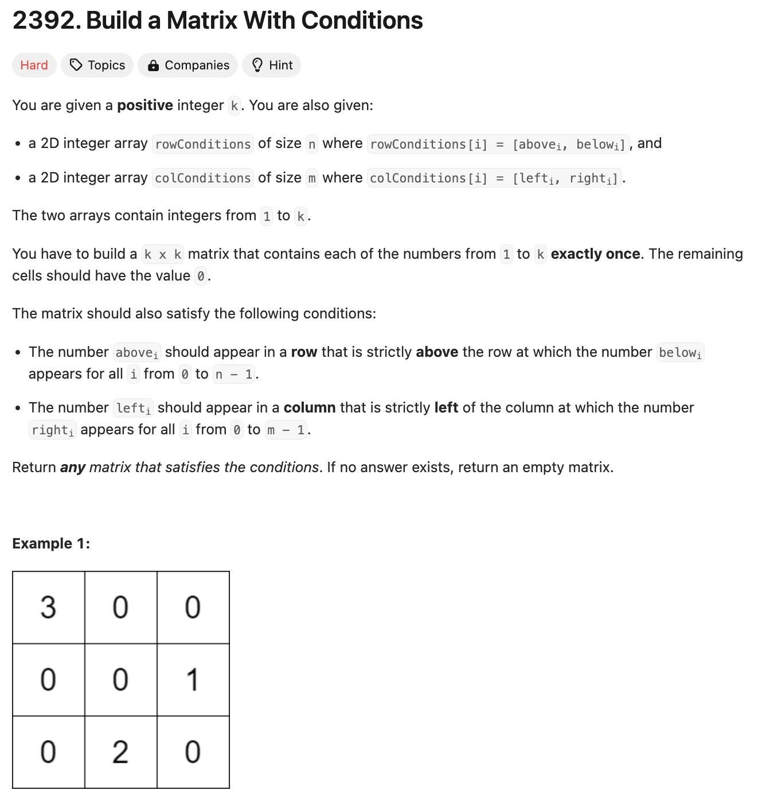

# 문제 설명
여러 조건을 충족하는 행렬을 만드는 문제입니다.




## 풀이 및 해설
- Topological Sort를 이용하여 숫자들의 순서를 정하고, 이를 이용하여 행렬을 만들어주면 됩니다.  
    - 행에 대한 조건들에 대해서는 DAG를 만들어주고, abovei과 belowi를 잇는 간선이 abovei가 먼저 나와야 한다는 것을 의미합니다.
    - 동일하게, 열에 대해서는 DAG를 만들어주고, lefti와 righti를 잇는 간선이 lefti가 먼저 나와야 한다는 것을 의미합니다.
    - 이후, Topological Sort를 이용하여 순서를 정하고, 이를 이용하여 행렬을 만들어주면 됩니다.
- Matrix Construction을 사용해서 행렬을 만들어주면 됩니다.

## 풀이
```python
from typing import List
from collections import defaultdict, deque

class Solution:
    def buildMatrix(self, k: int, rowConditions: List[List[int]], colConditions: List[List[int]]) -> List[List[int]]:
        
        def topological_sort(conditions):
            # create a graph and in-degree dictionary
            graph = defaultdict(list)
            in_degree = {i: 0 for i in range(1, k+1)}

            # build the graph and in-degree count from conditions
            for u,v in conditions:
                graph[u].append(v)
                in_degree[v] += 1

            # queue to process nodes with in-degree of 0
            queue = deque([node for node in in_degree if in_degree[node] == 0])

            topo_order = []

            while queue:
                node = queue.popleft()
                topo_order.append(node)
                for neighbor in graph[node]:
                    in_degree[neighbor] -= 1
                    if in_degree[neighbor] == 0:
                        queue.append(neighbor)

            # if the topological sort includes all nodes, return the order
            if len(topo_order) == k:
                return topo_order
            else:
                return []

        # get the topological order for rows and columns
        row_order = topological_sort(rowConditions)
        col_order = topological_sort(colConditions)

        # if either topological sort fails, return an empty matrix
        if not row_order or not col_order:
            return []

        # map each number to its position in the row and column orders
        row_pos = {num: i for i, num in enumerate(row_order)}
        col_pos = {num: i for i, num in enumerate(col_order)}

        # initialize the k x k matrix with zeros
        matrix = [[0] * k for _ in range(k)]

        # place each number in the matrix according to its row and positions
        for num in range(1, k+1):
            r = row_pos[num]
            c = col_pos[num]
            matrix[r][c] = num

        return matrix
```

## Complexity Analysis  


### 시간 복잡도
- Topological Sort를 이용하여 순서를 정하고, 이를 이용하여 행렬을 만들어주면 됩니다.
- Topological Sort의 시간 복잡도는 O(V+E)입니다. 이때, V는 노드의 수, E는 간선의 수입니다.
- 따라서, 전체 시간 복잡도는 O(V+E)입니다.

### 공간 복잡도
- Topological Sort를 위한 그래프와 in-degree를 저장하기 위한 공간이 필요합니다.
- 따라서, 전체 공간 복잡도는 O(V+E)입니다.

## Constraint Analysis
```
Constraints:
2 <= k <= 400
1 <= rowConditions.length, colConditions.length <= 10^4
rowConditions[i].length == colConditions[i].length == 2
1 <= abovei, belowi, lefti, righti <= k
abovei != belowi
lefti != righti
```

# References
- [2392. Build a Matrix With Conditions](https://leetcode.com/problems/build-a-matrix-with-conditions/)
- [Topological Sort](https://en.wikipedia.org/wiki/Topological_sorting)
- [GeeksforGeeks - Topological Sort](https://www.geeksforgeeks.org/topological-sorting/)
- [GeeksforGeeks - Kahn's Algorithm](https://www.geeksforgeeks.org/topological-sorting-indegree-based-solution/)