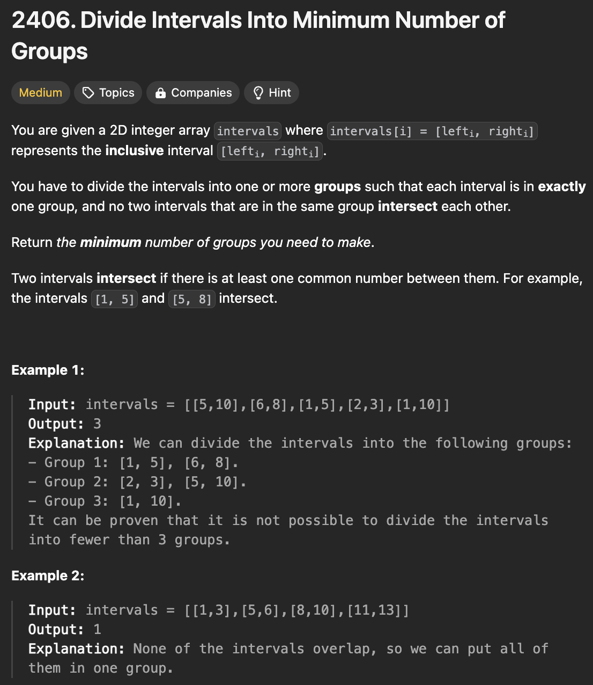

# 문제 설명
이 문제는 2D 배열로 주어진 구간을 최소한의 그룹으로 나누는 문제이다.



## 풀이 및 해설

## 풀이
```python
class Solution:
    def minGroups(self, intervals: List[List[int]]) -> int:
        events = []
        for start, end in intervals:
            events.append((start, 1))
            events.append((end+1, -1))

        events.sort()

        count = 0
        max_count = 0

        for _, event in events:
            count += event
            max_count = max(max_count, count)
        
        return max_count
```

## Complexity Analysis


### 시간 복잡도
- O(NlogN) ; N은 intervals의 길이

### 공간 복잡도
- O(N) ; events 배열의 길이

## Constraint Analysis
```
Constraints:
1 <= intervals.length <= 10^5
intervals[i].length == 2
1 <= lefti <= righti <= 106
```

# References
- [2406. Divide Intervals Into Minimum Number of Groups](https://leetcode.com/problems/divide-intervals-into-minimum-number-of-groups/)