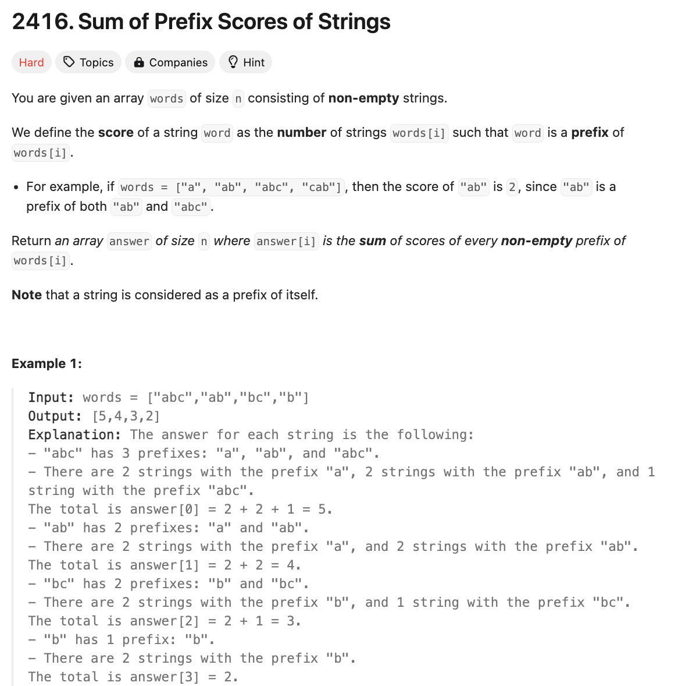

# 문제 설명

단어 배열 words가 주어진다. 이때 각 단어의 prefix score를 계산하여 모든 단어의 prefix score의 합을 반환하라.

그러면 해야 하는 subtask로 나누면 다음과 같다:
1. 각 단어의 prefix를 모두 찾는다.
2. 해당 prefix가 등장하는 단어의 수를 센다.
3. 단어의 prefix 등장 횟수들을 합산하여 prefix score를 계산한다.
4. 모든 단어에 대한 prefix score를 배열에 추가하여 반환한다.



## 풀이 및 해설
이번주 주제가 trie인 만큼 trie를 이용해서 푸는 방법을 생각해보자.

단어의 글자를 하나의 노드로 취급해서 trie를 만든 뒤, 탐색을 하면 될것 같다.

## 풀이
```python
class TrieNode:
    def __init__(self):
        self.children = {}
        self.count = 0

class Trie:
    def __init__(self):
        self.root = TrieNode()

    def insert(self, word):
        node = self.root
        for char in word:
            if char not in node.children:
                node.children[char] = TrieNode()
            node = node.children[char]
            node.count += 1
    
    def get_score(self, word):
        node = self.root
        score = 0
        for char in word:
            if char not in node.children:
                break
            node = node.children[char]
            score += node.count
        return score
        

class Solution:
    def sumPrefixScores(self, words: List[str]) -> List[int]:
        trie = Trie()

        # 모든 단어 trie에 추가
        for word in words:
            trie.insert(word)

        # 모든 단어에 대해서 점수 계산
        scores = []
        for word in words:
            scores.append(trie.get_score(word))
        
        return scores
```
- TrieNode 클래스를 정의한다.
- Trie 클래스를 정의한다.
    - insert 메소드를 정의한다.
    - get_score 메소드를 정의한다.
    - sumPrefixScores 메소드를 정의한다.

- Solution 클래스를 정의한다.
    - sumPrefixScores 메소드를 정의한다.
    - Trie 클래스를 생성한다.
    - 모든 단어를 trie에 추가한다.
    - 모든 단어에 대해서 점수를 계산한다.
    - 점수를 반환한다.

## Complexity Analysis


### 시간 복잡도
- O(NL) : N은 단어의 개수, L은 단어의 길이

### 공간 복잡도
- O(NL) : N은 단어의 개수, L은 단어의 길이

## Constraint Analysis
```
Constraints:
1 <= words.length <= 1000
1 <= words[i].length <= 1000
words[i] consists of lowercase English letters.
```

# References
- [2416. Sum of Prefix Scores of Strings](https://leetcode.com/problems/sum-of-prefix-scores-of-strings/)