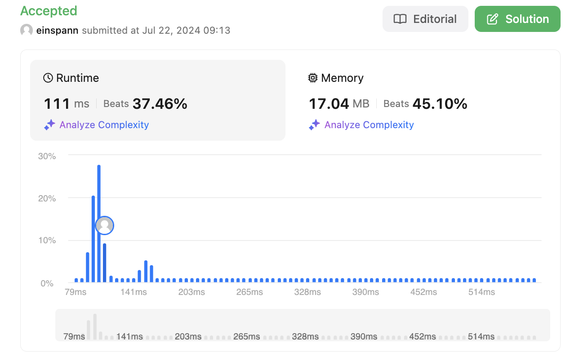

# 문제 설명
사람들과 그들의 키가 주어졌을 때, 키 내림차순으로 정렬된 이름들을 반환하는 문제다.


## 풀이 및 해설
- 키 내림차순으로 정렬하고 이름들만 반환.

## 풀이
```python
def sortPeople(self, names: List[str], heights: List[int]) -> List[str]:
        people = list(zip(names, heights))
        people.sort(key=lambda x: x[1], reverse=True)
        return [x[0] for x in people]
```

## Complexity Analysis


### 시간 복잡도
- O(nlogn)의 시간 복잡도를 가진다.
- n은 names의 길이이다.
- sort 함수의 시간 복잡도는 O(nlogn)이다.

### 공간 복잡도
- O(n)의 공간 복잡도를 가진다.
- n은 names의 길이이다.

## Constraint Analysis
```
Constraints:
n == names.length == heights.length
1 <= n <= 103
1 <= names[i].length <= 20
1 <= heights[i] <= 10^5
names[i] consists of lower and upper case English letters.
All the values of heights are distinct.
```

# References
- [2418. Sort the People](https://leetcode.com/problems/sort-the-people-the-tallest-first/)
```