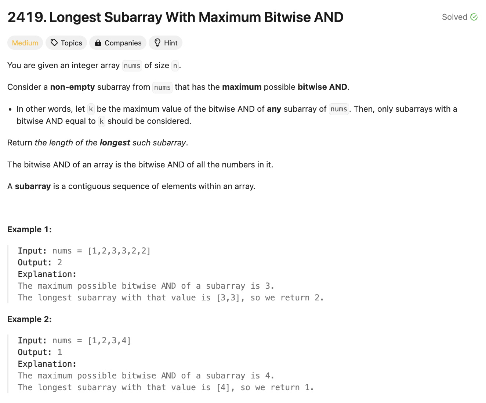
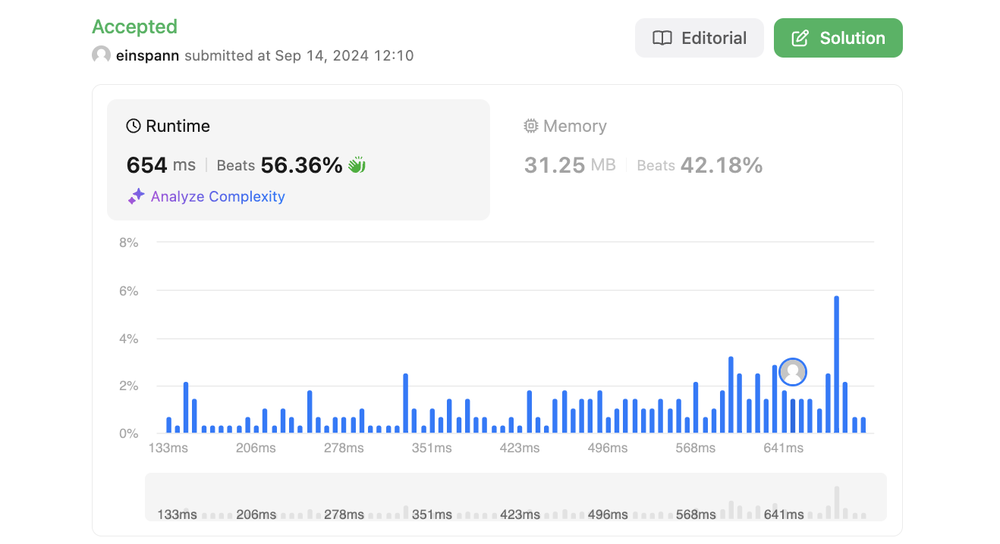

# 문제 설명
이 문제는 주어진 배열에서 최대 비트 AND를 가진 가장 긴 부분 배열의 길이를 구하는 문제이다.

문제 난이도는 중간인데 체감상 더 어려웠다.




## 풀이 및 해설

## 풀이
```python
class Solution:
    def longestSubarray(self, nums: List[int]) -> int:
        mx = max(nums)
        longest = cur = 0
        for num in nums:
            if num == mx:
                cur += 1
                longest = max(longest, cur)
            else:
                cur = 0
        
        return longest
```

## Complexity Analysis


### 시간 복잡도
- O(N) ; N은 주어진 배열의 길이

### 공간 복잡도
- O(1) ; 상수만큼의 공간 사용

## Constraint Analysis
```
Constraints:
1 <= nums.length <= 10^5
1 <= nums[i] <= 10^6
```

# References
- [2419. Longest Subarray With Maximum Bitwise AND](https://leetcode.com/problems/longest-subarray-with-maximum-bitwise-and/)