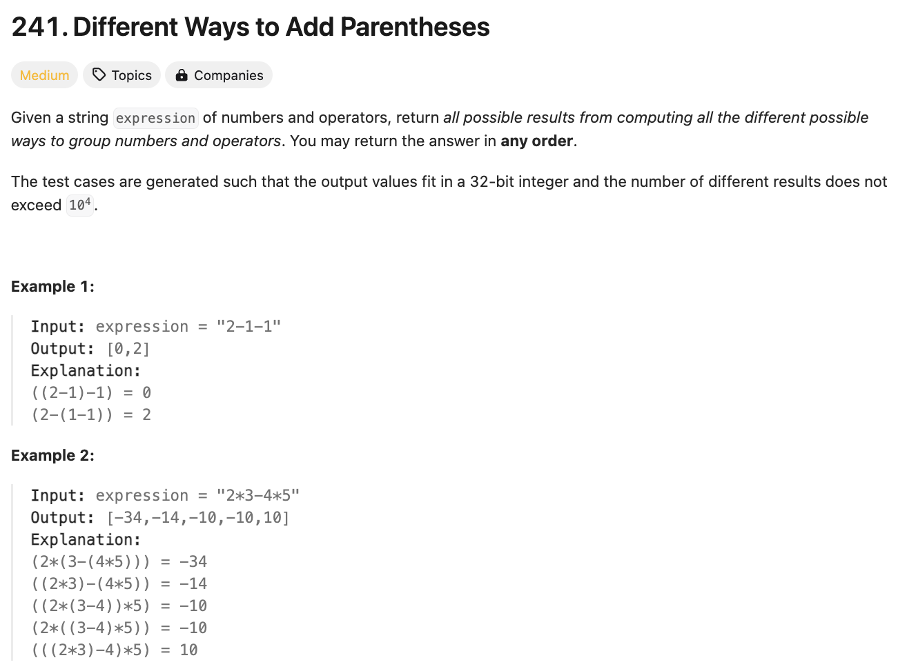

# 문제 설명
숫자와 연산자로 이루어진 수식이 주어진다. 이 수식에 괄호를 추가하여 가능한 모든 결과를 구하는 문제다.



## 풀이 및 해설

## 풀이
```python
def diffWaysToCompute(self, expression: str) -> List[int]:
    memo = {}
    
    def compute(expr):
        if expr in memo:
            return memo[expr]
        
        if expr.isdigit():
            return [int(expr)]
        
        results = []
        for i, char in enumerate(expr):
            if char in ['+', '-', '*']:
                left = compute(expr[:i])
                right = compute(expr[i+1:])
                
                for l in left:
                    for r in right:
                        if char == '+':
                            results.append(l + r)
                        elif char == '-':
                            results.append(l - r)
                        else:  # char == '*'
                            results.append(l * r)
        
        memo[expr] = results
        return results
    
    return compute(expression)
```

## Complexity Analysis


### 시간 복잡도
- O(N^3 * C(N)) ; N은 expression의 길이, C(N)은 Catalan Number라고 괄호의 경우의 수를 찾는데 필요한 시간이다.

### 공간 복잡도
- O(N^2 * C(N)) ; memoization을 위한 공간이다.

## Constraint Analysis
```
Constraints:
1 <= expression.length <= 20
expression consists of digits and the operator '+', '-', and '*'.
All the integer values in the input expression are in the range [0, 99].
```

# References
- [241. Different Ways to Add Parentheses](https://leetcode.com/problems/different-ways-to-add-parentheses/)