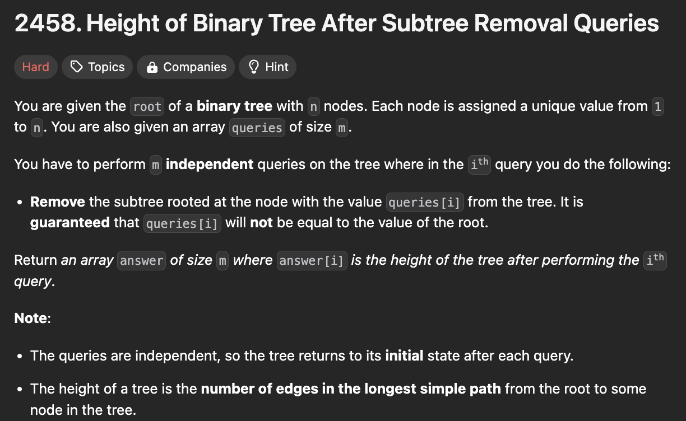
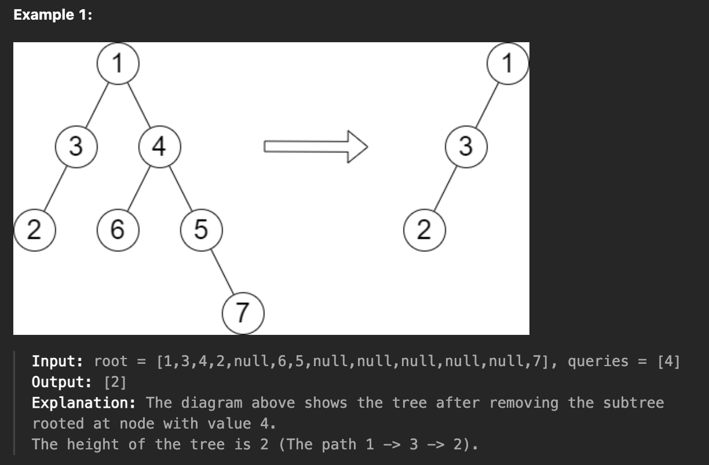

# 문제 설명
이 문제는 이진 트리와 쿼리가 주어지면, 쿼리에 삭제하는 것에 따라 트리의 높이를 계산하는 문제입니다.




## 풀이 및 해설
못 풀어서 Editorial을 참고했는데, 왼쪽에서 오른쪽으로, 그리고 오른쪽에서 왼쪽으로 두 번의 DFS를 사용하여 문제를 해결할 수 있습니다.

## 풀이
```python
# Definition for a binary tree node.
# class TreeNode:
#     def __init__(self, val=0, left=None, right=None):
#         self.val = val
#         self.left = left
#         self.right = right
class Solution:
    def treeQueries(self, root: Optional[TreeNode], queries: List[int]) -> List[int]:
        max_height_after_removal = [0] * 100001
        self.current_max_height = 0

        def _traverse_left_to_right(node, current_height):
            if not node:
                return
        
            # store the maximum height if this node were removed
            max_height_after_removal[node.val] = self.current_max_height

            # update the current maximum height
            self.current_max_height = max(
                self.current_max_height, current_height
            )

            # traverse left subtree first, then right
            _traverse_left_to_right(node.left, current_height+1)
            _traverse_left_to_right(node.right, current_height+1)
        
        def _traverse_right_to_left(node, current_height):
            if not node:
                return
            
            # update the maximum height if this node were removed
            max_height_after_removal[node.val] = max(
                max_height_after_removal[node.val], self.current_max_height
            )

            # update the current maximum height
            self.current_max_height = max(
                current_height, self.current_max_height
            )

            # traverse right subtree first, then left
            _traverse_right_to_left(node.right, current_height+1)
            _traverse_right_to_left(node.left, current_height+1)
        
        _traverse_left_to_right(root, 0)
        self.current_max_height = 0 # reset for the second traversal
        _traverse_right_to_left(root, 0)

        # process queries and build the result list
        return [max_height_after_removal[q] for q in queries]
```

## Complexity Analysis


### 시간 복잡도
- 트리의 높이를 계산하는 데에는 `O(n)`이 소요됩니다.

### 공간 복잡도
- `max_height_after_removal` 배열을 사용하여 각 노드를 제거했을 때의 높이를 저장합니다. 이 배열의 크기는 `O(n)`입니다.

## Constraint Analysis
```
Constraints:
The number of nodes in the tree is n.
2 <= n <= 10^5
1 <= Node.val <= n
All the values in the tree are unique.
m == queries.length
1 <= m <= min(n, 10^4)
1 <= queries[i] <= n
queries[i] != root.val
```

# References
- [2458. Height of Binary Tree After Subtree Removal Queries](https://leetcode.com/problems/height-of-binary-tree-after-subtree-removal-queries/)