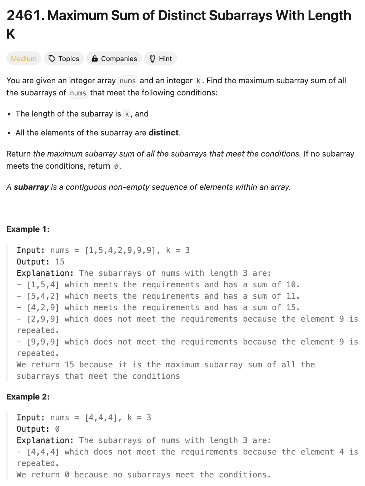

# 문제 설명
배열과 정수 k가 주어질 때, 서로 다른 k 길이의 부분 배열의 합 중 최대값을 찾는 문제이다.



## 풀이 및 해설

## 풀이
```python
class Solution:
    def maximumSubarraySum(self, nums: List[int], k: int) -> int:
        n = len(nums)
        if n < k:
            return 0
        
        window_sum = 0
        max_sum = 0
        window = {}
        start = 0
        
        for end in range(n):
            # Add the current element to the window
            window_sum += nums[end]
            window[nums[end]] = window.get(nums[end], 0) + 1
            
            # If the window size is greater than k, remove elements from the start
            if end - start + 1 > k:
                window_sum -= nums[start]
                window[nums[start]] -= 1
                if window[nums[start]] == 0:
                    del window[nums[start]]
                start += 1
            
            # If the window size is k and all elements are distinct, update max_sum
            if end - start + 1 == k and len(window) == k:
                max_sum = max(max_sum, window_sum)
            
            # If we encounter a duplicate, move the start pointer
            while len(window) < end - start + 1:
                window_sum -= nums[start]
                window[nums[start]] -= 1
                if window[nums[start]] == 0:
                    del window[nums[start]]
                start += 1
        
        return max_sum
```
- `window_sum`은 현재 윈도우의 합을 저장하는 변수이다.
- `max_sum`은 서로 다른 k 길이의 부분 배열의 합 중 최대값을 저장하는 변수이다.
- `window`는 현재 윈도우에 포함된 요소들을 저장하는 딕셔너리이다.
- `start`는 윈도우의 시작 인덱스를 저장하는 변수이다.
- `end`는 윈도우의 끝 인덱스를 저장하는 변수이다.
- `window_sum`에 현재 요소를 더하고, `window`에 현재 요소를 추가한다.
  - `window`에 현재 요소가 없다면 0을 반환하고, 1을 더한다.
  - `window_sum`에 현재 요소를 더한다.
  - `end`를 1 증가시킨다.
  - 윈도우의 크기가 k보다 크다면, 시작 인덱스를 증가시킨다.
    - `window_sum`에서 시작 요소를 빼고, `window`에서 시작 요소의 개수를 1 감소시킨다.
    - `window`에서 시작 요소의 개수가 0이라면, 해당 요소를 삭제한다.
    - `start`를 1 증가시킨다.
    - 윈도우의 크기가 k이고, 모든 요소가 서로 다르다면, `max_sum`을 업데이트한다.
    - 윈도우에 중복된 요소가 있다면, 시작 인덱스를 증가시킨다.
      - `window_sum`에서 시작 요소를 빼고, `window`에서 시작 요소의 개수를 1 감소시킨다.
      - `window`에서 시작 요소의 개수가 0이라면, 해당 요소를 삭제한다.
      - `start`를 1 증가시킨다.
- `max_sum`을 반환한다.

## Complexity Analysis


### 시간 복잡도
- 시간 복잡도는 O(n)이다.

### 공간 복잡도
- 공간 복잡도는 O(k)이다.

## Constraint Analysis
```
Constraints:
1 <= k <= nums.length <= 10^5
1 <= nums[i] <= 10^5
```

# References
- [2461. Maximum Sum of Distinct Subarrays With Length K](https://leetcode.com/problems/maximum-sum-of-distinct-subarrays-with-length-k/)