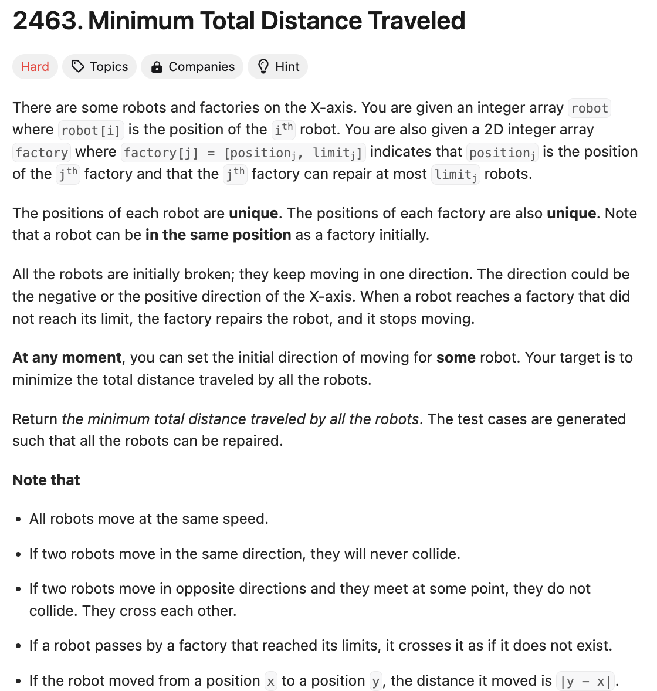

# 문제 설명
이 문제는 두개의 배열이 주어진다.
- 첫번째 배열에서는 로봇들의 위치가 주어진다.
- 두번째 배열에서는 공장의 위치와 공장에서 수리할 수 있는 로봇의 수가 주어진다.

이때, 모든 로봇을 수리하기 위해 이동해야 하는 최소 거리를 구하는 문제이다.



## 풀이 및 해설
이 문제를 풀기 위해 memoization과 DP를 사용해야 한다.  
특히, 지금 공장을 사용할지 말지 기준으로 재귀적으로 탐색해야 한다.

## 풀이
```python
class Solution:
    def minimumTotalDistance(self, robot: List[int], factory: List[List[int]]) -> int:
        robot.sort()
        factory.sort()
        memo = {}

        def dp(i,j):
            # if all robots are repaired, return 0
            if i == len(robot):
                return 0

            # if no more factories available, return infinity
            if j == len(factory):
                return float('inf')

            # check if the result is already memoized
            if (i,j) in memo:
                return memo[(i,j)]
            
            # option 1: skip current factory
            ans= dp(i,j+1)

            # option 2: use current factory
            cur = 0
            for k in range(min(factory[j][1], len(robot)-i)):
                cur += abs(robot[i+k] - factory[j][0])
                ans = min(ans, cur + dp(i+k+1, j+1))
            
            # memoize the result
            memo[(i,j)] = ans
            return ans
        
        return dp(0,0)
```

## Complexity Analysis


### 시간 복잡도
- O(N*M*L)
  - N: 로봇의 수
  - M: 공장의 수
  - L: 공장의 최대 수리 가능 로봇 수

### 공간 복잡도
- O(N*M)
  - N: 로봇의 수
  - M: 공장의 수

## Constraint Analysis
```
Constraints:
1 <= robot.length, factory.length <= 100
factory[j].length == 2
-10^9 <= robot[i], positionj <= 10^9
0 <= limitj <= robot.length
The input will be generated such that it is always possible to repair every robot.
```

# References
- [2463. Minimum Total Distance Traveled](https://leetcode.com/problems/minimum-total-distance-traveled/)