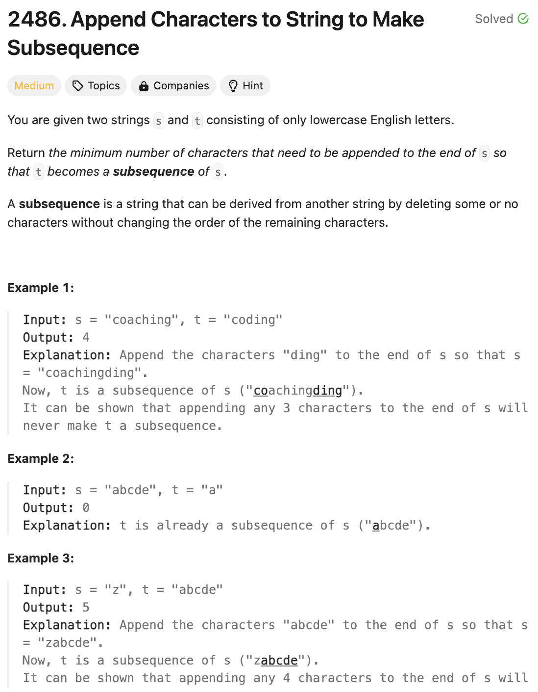

# 문제 설명
6월 3일에 출제됐던 문제를 시간 돌아가기 티켓으로 풀어보았다.

이 문제는 s와 t가 주어지면 s에 문자를 몇개 추가하여 t를 만들 수 있는지 확인하는 문제이다.



## 풀이 및 해설

## 풀이
```python
def appendCharacters(self, s: str, t: str) -> int:
    s_ptr = 0
    t_ptr = 0

    while s_ptr < len(s) and t_ptr < len(t):
        if s[s_ptr] == t[t_ptr]:
            t_ptr += 1
        s_ptr += 1
    
    return len(t) - t_ptr
```
- s_ptr와 t_ptr의 길이만큼 반복을 하며 s_ptr와 t_ptr가 같은 문자를 가리키면 t_ptr를 증가시킨다.
- s_ptr은 계속 증가시킨다.
- t_ptr의 길이에서 t_ptr를 뺀 값을 반환한다.

## Complexity Analysis


### 시간 복잡도
- O(N)

### 공간 복잡도
- O(1)

## Constraint Analysis
```
Constraints:
1 <= s.length, t.length <= 10^5
s and t consist only of lowercase English letters.
```

# References
- [3110. Score of a String](https://leetcode.com/problems/score-of-a-string/)