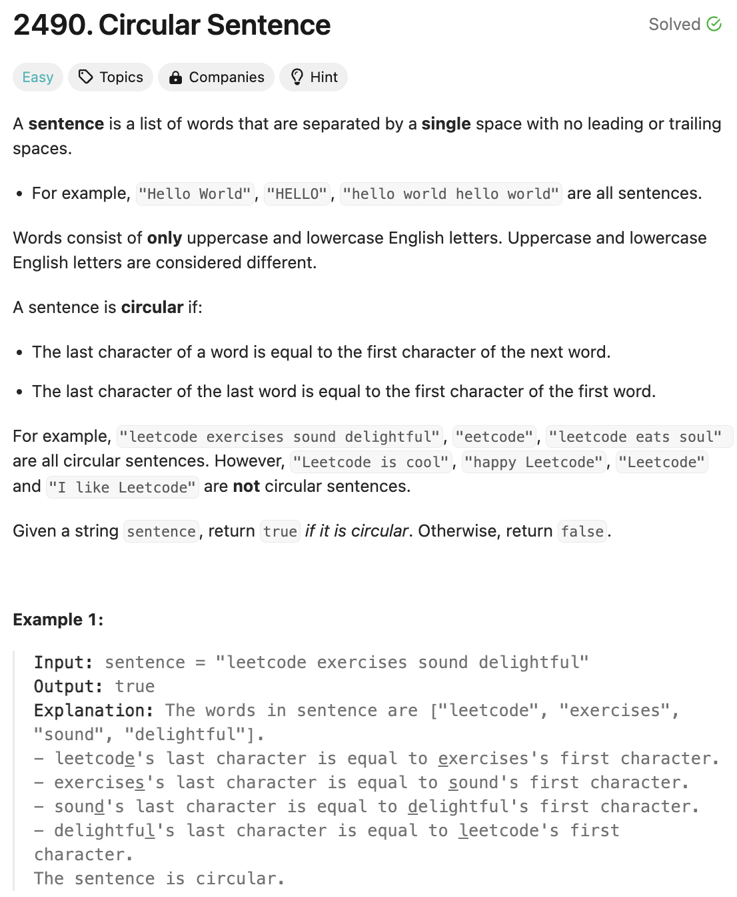
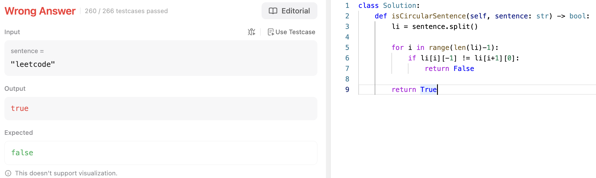

# 문제 설명
문장에서 모든 단어에 대하여 단어의 마지막 단어와 그 다음 단어의 첫번째 단어가 같으면 circular sentence라고 합니다. 문장이 주어지면 circular sentence인지 판별하는 문제입니다.



## 풀이 및 해설
간단하게 모든 단어에 대해서 마지막 단어와 다음 단어의 첫번째 단어가 같은지 확인하면 된다.

근데 예외처리를 안해서 틀렸다. 초짜같은 실수다.




## 풀이
```python
def isCircularSentence(self, sentence: str) -> bool:
    li = sentence.split()

    # edgecase
    if len(li) <= 1:
        if li[0][0] != li[-1][-1]:
            return False
        else:
            return True
    
    # more than one word
    for i in range(len(li)-1):
        if li[i][-1] != li[i+1][0]:
            return False
    
    # last and first
    if li[0][0] != li[-1][-1]:
            return False
    
    return True
```

## Complexity Analysis


### 시간 복잡도
- O(N) : 문장의 길이만큼 반복하므로 O(N)이다.

### 공간 복잡도
- O(N) : 문장을 리스트로 변환하므로 O(N)이다.

## Constraint Analysis
```
Constraints:
1 <= sentence.length <= 500
sentence consist of only lowercase and uppercase English letters and spaces.
The words in sentence are separated by a single space.
There are no leading or trailing spaces.
```

# References
- [2490. Circular Sentence](https://leetcode.com/problems/circular-sentence/)