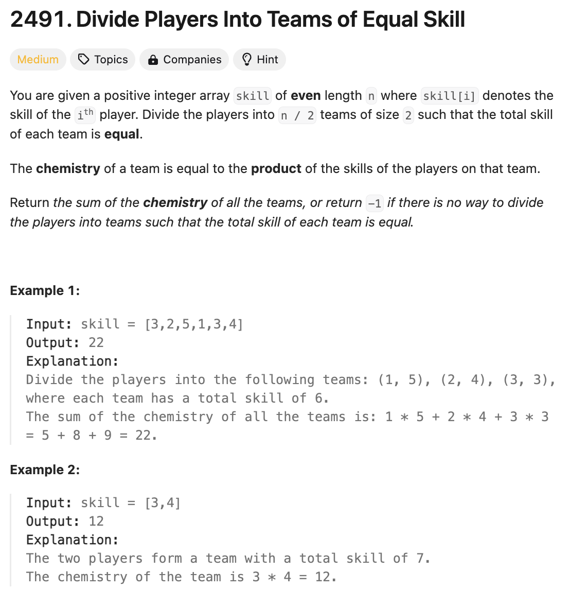
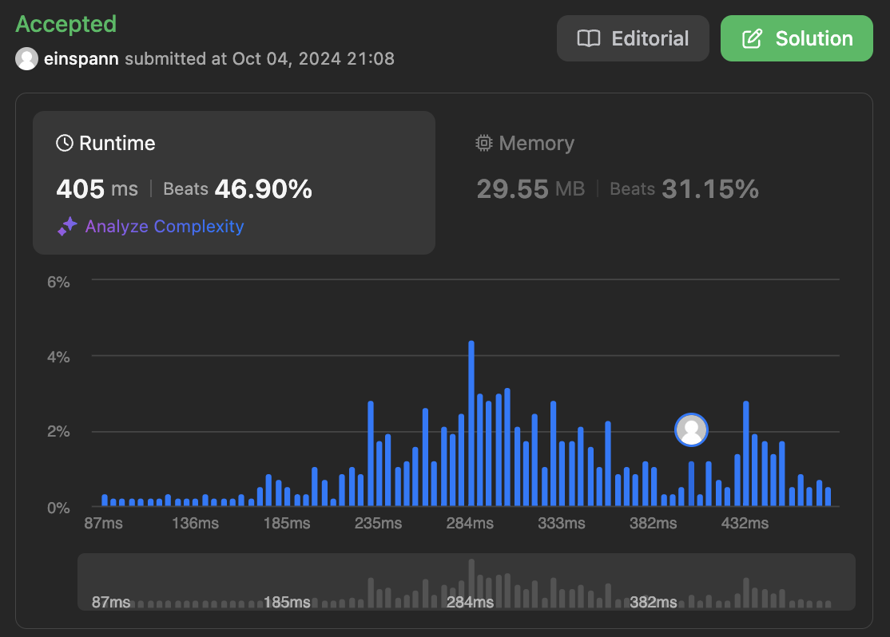

# 문제 설명
이 문제는 운동 선수들의 능력치가 배열으로 주어졌을 때, 능력치가 같은 선수들을 2인조 팀으로 나누는게 가능한지 알아보는 문제이다.



## 풀이 및 해설


## 풀이
```python
def dividePlayers(self, skill: List[int]) -> int:
    skill.sort()
    n = len(skill)
    left, right = 0, n-1
    target = skill[0] + skill[-1]
    total_chemistry = 0

    while left < right:
        current_sum = skill[left] + skill[right]

        if current_sum != target:
            return -1
        
        total_chemistry += skill[left] * skill[right]
        left += 1
        right -= 1
    
    return total_chemistry
```
- skill을 정렬
- left, right 포인터를 0과 n-1로 초기화
- target을 skill[0] + skill[-1]로 초기화
- total_chemistry를 0으로 초기화
- left < right일 때까지 반복
    - current_sum을 skill[left] + skill[right]로 초기화
    - current_sum이 target과 다르다면 -1 반환
    - total_chemistry에 skill[left] * skill[right]를 더함
    - left += 1, right -= 1
- total_chemistry 반환

## Complexity Analysis


### 시간 복잡도
- 시간 복잡도: O(NlogN) ; skill을 정렬하는데 NlogN, left < right일 때까지 반복하므로 O(N)

### 공간 복잡도
- 공간 복잡도: O(1) ; total_chemistry, left, right, target만 사용

## Constraint Analysis
```
Constraints:
2 <= skill.length <= 10^5
skill.length is even.
1 <= skill[i] <= 1000
```

# References
- [2491. Divide Players Into Teams of Equal Skill](https://leetcode.com/problems/divide-players-into-teams-of-equal-skill/)