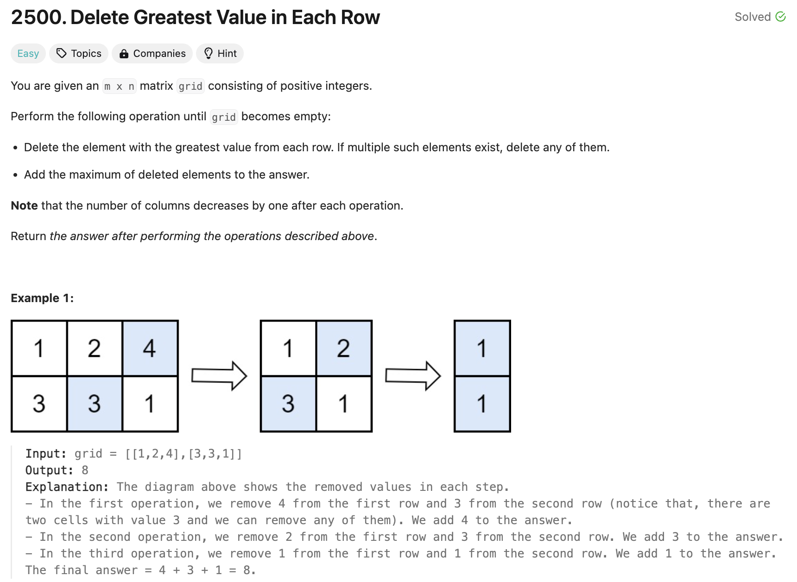
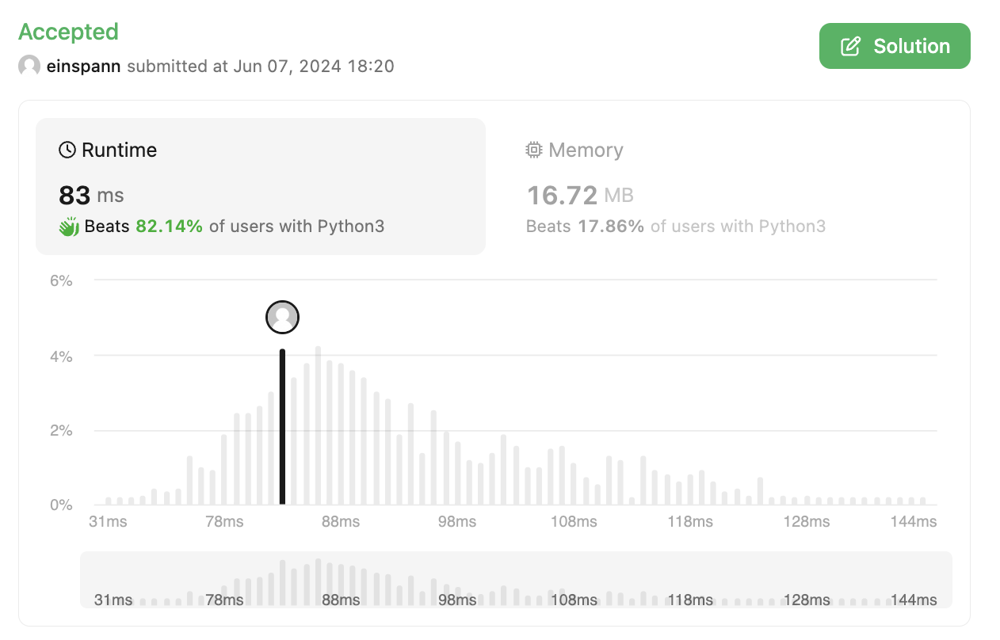

## 문제 설명
배열이 주어졌을 때, 각 행에서 가장 큰 값을 지우고, 새로운 배열에 추가하는 문제다.



## 풀이 해설
제일 큰 값을 지속적으로 찾아야 함으로서 heap 자료구조를 사용하는게 좋을것 같다. 주어진 num 배열을 우선 heap으로 변환하여, 순차적으로 하나씩 차감하고 새로운 배열에 추가한다.

- 파이썬의 heapq는 min-heap이기 때문에 max-heap을 하기 위해 모든 값을 -1을 곱해준다.
- 각 행에 대하여 heapify를 수행한다.
- 각 행에서 가장 큰 값을 pop하고, 그 값들 중 가장 큰 값을 sum에 더해준다.


## 풀이
```python
import heapq

class Solution:
    def deleteGreatestValue(self, grid: List[List[int]]) -> int:
        # Create max-heap by negating values
        for i in range(len(grid)):
            for j in range(len(grid[i])):
                grid[i][j] = grid[i][j] * -1
            heapq.heapify(grid[i])

        sum = 0
        # Pop heap until empty
        while len(grid[0]) != 0:
            max_val = 0
            for i in range(len(grid)):
                # Pop largest value
                temp = heapq.heappop(grid[i])
                # If popped value is larger than the current largest value, replace it
                if max_val > temp:
                    max_val = temp
            # Once all rows have been checked, add to sum
            sum += max_val
        
        return (sum*-1)

```

## Complexity Analysis


### Time Complexity
- Max-heap: 
    - M개 행에 대하여 for loop 실행.
    - N개 열에 대하여 for loop 실행.
    - 행에 있는 모든 값에 -1 곱하기: O(N)
    - 각 행 Heapify: O(N)  
    
    즉, 해당 부분의 시간복잡도는 O(MN)이다.

- Main-loop (while loop):
    - M개 행에 대하여 loop 실행.
    - M번만큼 for loop 실행.
    - heappop: O(logN)  

    즉, O(NMlogN)이다.

- 두 부분 모두 합치면 O(MNlogN)이다.


### Space Complexity
- grid에 대한 O(MN) 공간이 필요하다.

## Constraint Analysis
```
Constraints:

m == grid.length
n == grid[i].length
1 <= m, n <= 50
1 <= grid[i][j] <= 100
```

- 시간복잡도는 O(MNlogN)이므로, M,N은 최대 50이다. O(50log50)에 대하여 최악의 경우에 최대 14250번의 연산이 필요하다.
- 공간복잡도는 O(MN)이다. N은 최대 2500이다.

# References
- [LeetCode](https://leetcode.com/problems/delete-greatest-value-in-each-row/)
- [Heap Queue](https://docs.python.org/3/library/heapq.html)
