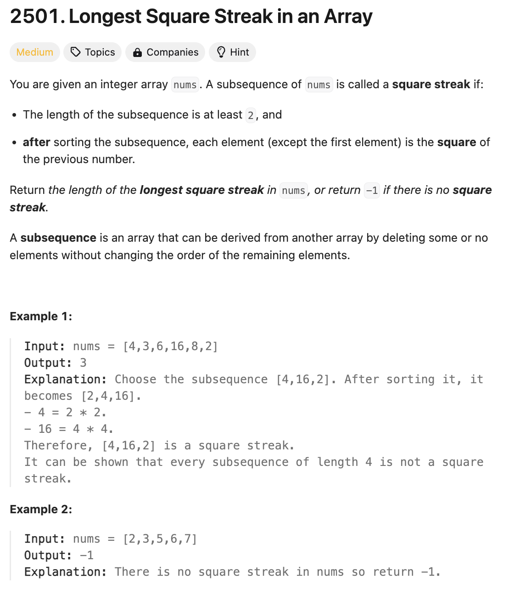

# 문제 설명
이 문제는 주어진 배열을 정렬할 경우, 가장 긴 연속된 정사각형 부분수열의 길이를 구하는 문제다.  
이때, 정사각형 부분수열이란, 다음 요소가 이전 요소의 제곱인 경우를 말한다.



## 풀이 및 해설

## 풀이
```python
class Solution:
    def longestSquareStreak(self, nums: List[int]) -> int:
        nums.sort()
        num_set = set(nums)
        max_streak = 0

        for num in nums:
            if num ** 0.5 not in num_set: # only start a streak if it is not part of a previous streak
                current_streak = 1
                while num*num in num_set:
                    current_streak += 1
                    num *= num
                max_streak = max(max_streak, current_streak)
        
        return max_streak if max_streak >= 2 else -1
```
- 주어진 배열을 정렬하고, 정렬된 배열을 O(1) 시간에 조회할 수 있도록 set으로 변환한다.
- 정렬된 배열을 순회하면서, 현재 요소가 이전 요소의 제곱인 경우를 찾는다.
- 이때, 이전 요소가 이전에 발견된 정사각형 부분수열의 일부인 경우는 제외한다.
- 정사각형 부분수열을 찾으면, 현재 부분수열의 길이를 갱신하고, 최대 부분수열의 길이를 갱신한다.
- 최대 부분수열의 길이가 2 이상인 경우, 최대 부분수열의 길이를 반환하고, 그렇지 않은 경우 -1을 반환한다.

## Complexity Analysis


### 시간 복잡도
- 주어진 배열을 정렬하는데 O(NlogN) 시간이 소요된다.

### 공간 복잡도
- 주어진 배열을 정렬한 후, O(N) 크기의 set을 생성한다.

## Constraint Analysis
```
Constraints:
2 <= nums.length <= 10^5
2 <= nums[i] <= 10^5
```

# References
- [2501. Longest Square Streak in an Array](https://leetcode.com/problems/longest-square-streak-in-an-array/)