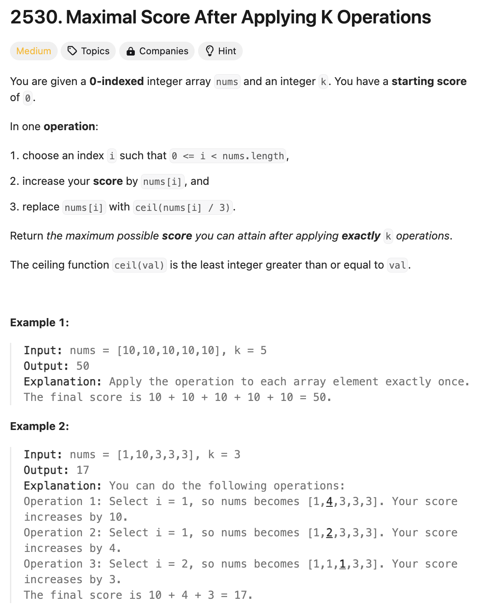

# 문제 설명
이 문제는 하나의 배열이 주어졌을 때, 배열의 최댓값을 찾아서 score에 더해주는 과정을 k번 반복하였을 때, 최종 score를 구하는 문제이다.  
이때, 더해진 값은 3으로 나누어 올림한 값으로 대체한다.



## 풀이 및 해설

## 1차 풀이
k만큼 반복하면서, 최대값을 찾아서 더해주는 방식으로 풀이하였다.

그러나, 이렇게 할 경우 Time Limit Exceeded가 발생하였다.

## 풀이
```python
class Solution:
    def maxKelements(self, nums: List[int], k: int) -> int:
        score = 0
        for i in range(k):
            max_value = max(nums)
            max_index = nums.index(max_value)
            score += max_value
            nums[max_index] = math.ceil(nums[max_index]/3)
        return score
```

## Complexity Analysis
- O(n*k) : n은 nums의 길이, k는 반복 횟수

너무 느리다.

## 2차 풀이
따라서, 최대값을 찾는 과정을 heap을 이용하여 최적화하였다.

## 풀이
```python
import heapq
import math

class Solution:
    def maxKelements(self, nums: List[int], k: int) -> int:
        score = 0
        heap = [-num for num in nums]
        heapq.heapify(heap)

        for _ in range(k):
            max_value = -heapq.heappop(heap)
            score += max_value
            heapq.heappush(heap, -math.ceil(max_value /3))
        
        return score
```
- list를 heap으로 변환할 때, 음수로 변환하여 최대값을 찾을 수 있도록 하였다.
- 최대값을 찾은 후, 다시 heap에 넣을 때는 3으로 나눈 값을 올림하여 넣어주었다.
- 이를 k번 반복하면서 score를 계산하였다.

## Complexity Analysis


### 시간 복잡도
- 최대값을 찾는 과정이 O(logn)이므로, 전체 시간 복잡도는 O(klogn)이다.

### 공간 복잡도
- heap을 사용하였으므로, O(n)이다.

## Constraint Analysis
```
Constraints:
1 <= nums.length, k <= 10^5
1 <= nums[i] <= 10^9
```

# References
- [2530. Maximal Score After Applying K Operations](https://leetcode.com/problems/maximal-score-after-applying-operations/)