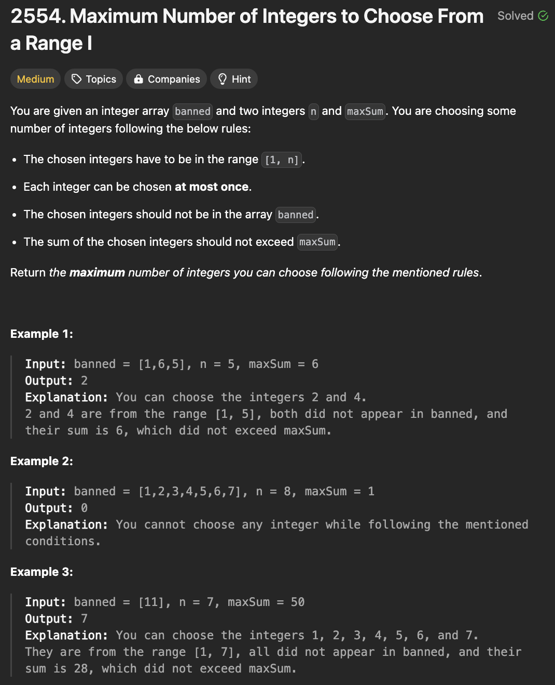
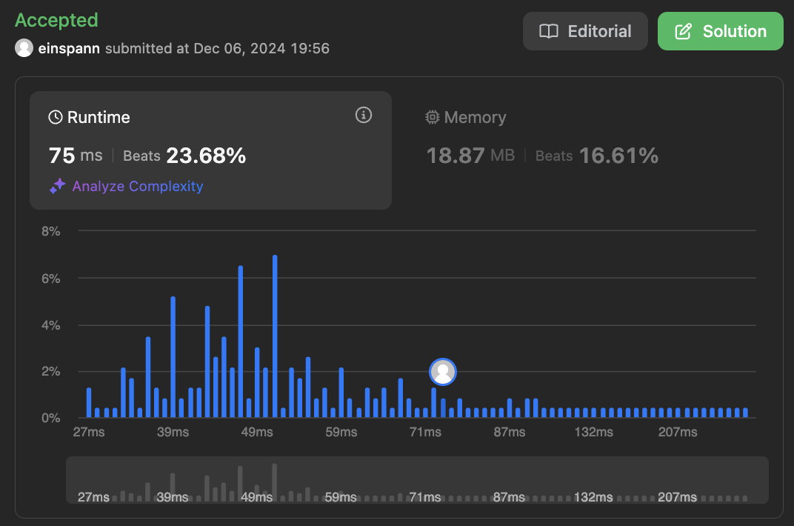

# 문제 설명
이 문제는 두개의 정수 n과 maxSum, 그리고 banned 배열이 주어진다. 이때, 다음 조건을 만족하는 최대의 정수 배열 길이를 반환하는 문제이다.

- i는 1부터 n까지의 정수이다.
- i는 banned 배열에 포함되어 있지 않아야 한다.
- i 값들을 선택할 때 합이 maxSum을 초과하지 않아야 한다.
- i는 중복되어서는 안된다.




## 풀이 및 해설


## 풀이
```python
class Solution:
    def maxCount(self, banned: List[int], n: int, maxSum: int) -> int:
        cur_sum = 0
        counter = 0
        i = 1
        
        while 1 <= i <= n:
            if cur_sum + i < maxSum and i not in banned:
                counter += 1
                cur_sum += i
            i += 1
        
        return counter
```
204/207개 케이스를 맞췄다. 보니까 <= maxSum을 했었어야 했다. 이렇게 고치니까 해결됐다.

```python
cur_sum = 0
        counter = 0
        banned = set(banned)
        
        for i in range(1, n+1):
            if cur_sum + i <= maxSum and i not in banned:
                counter += 1
                cur_sum += i
            if cur_sum >= maxSum:
                break
        
        return counter
```

## Complexity Analysis


### 시간 복잡도
- O(n^2)   
  - n개의 요소를 가진 banned 배열을 순회하면서, n개의 요소를 가진 배열을 순회한다.

### 공간 복잡도
- O(n)   
  - banned 배열을 set으로 변환하여 저장한다.

## Constraint Analysis
```
Constraints:
1 <= banned.length <= 10^4
1 <= banned[i], n <= 10^4
1 <= maxSum <= 10^9
```

# References
- [2554. Maximum Number of Integers to Choose From a Range I](https://leetcode.com/problems/maximum-number-of-integers-to-choose-from-a-range-i/)