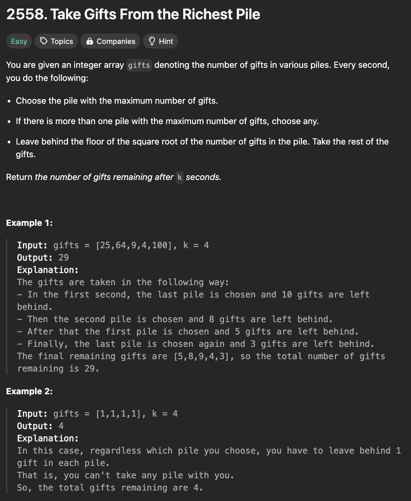

# 문제 설명
이 문제는 k초 동안 다음 연산을 반복했을 때, 최종적으로 가져갈 수 있는 선물의 갯수를 구하는 문제이다.

- 연산: 가장 많은 선물 더미의 제곱근을 구하고 대체한다.



## 풀이 및 해설

## 풀이
```python
class Solution:
    def pickGifts(self, gifts: List[int], k: int) -> int:
        for i in range(k):
            max_index = gifts.index(max(gifts))
            gifts[max_index] = int(math.sqrt(gifts[max_index]))
        
        return sum(gifts)
```

## Complexity Analysis


### 시간 복잡도
- O(kn) ; k는 연산 횟수, n은 선물의 갯수

### 공간 복잡도
- O(1)

## Constraint Analysis
```
Constraints:
1 <= gifts.length <= 10^3
1 <= gifts[i] <= 10^9
1 <= k <= 10^3
```

# References
- [2558. Take Gifts From the Richest Pile](https://leetcode.com/problems/take-gifts-from-the-richest-pile/)