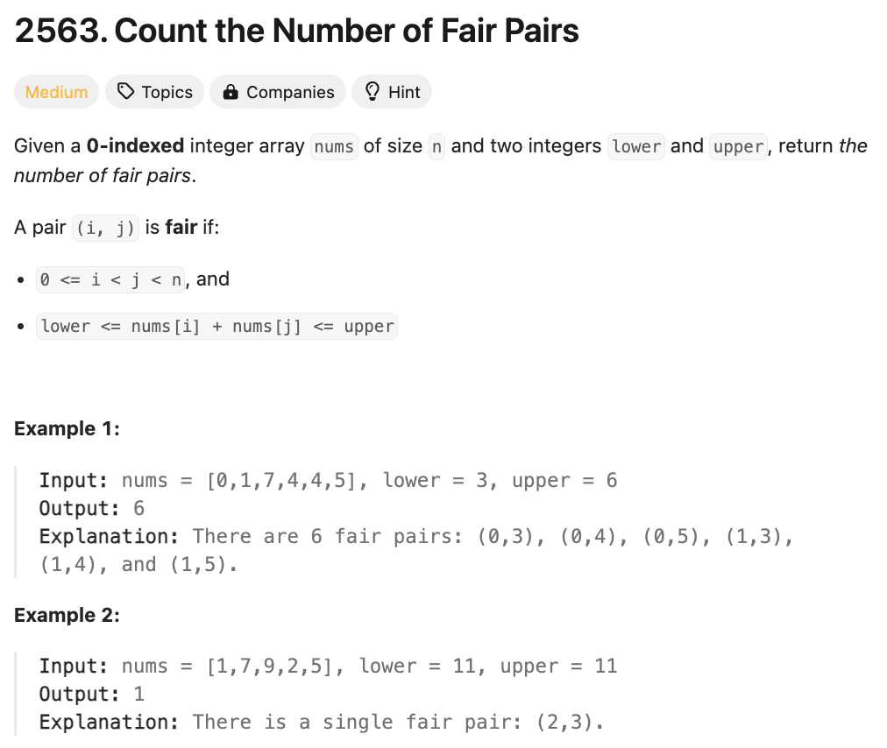

# 문제 설명
해당 문제에서는 fair pairs가 몇개인지 찾는 문제이다. 

fair pair의 조건은 다음과 같다:
- 0 <= i < j < n, and
- lower <= nums[i] + nums[j] <= upper




## 풀이 및 해설


## 풀이
```python
class Solution:
    def countFairPairs(self, nums: List[int], lower: int, upper: int) -> int:
        nums.sort()
        n = len(nums)

        def countLessThan(target): 
            left, right = 0, n-1
            count = 0
            while left<right:
                if nums[left] + nums[right] > target:
                    right -= 1
                else:
                    count += right - left
                    left += 1
            return count
        
        return countLessThan(upper) - countLessThan(lower-1)
```

## Complexity Analysis


### 시간 복잡도
- nums를 정렬하는데 O(nlogn)이 소요된다.
- countLessThan 함수는 O(n)이 소요된다.

### 공간 복잡도
- O(1)

## Constraint Analysis
```
Constraints:
1 <= nums.length <= 10^5
nums.length == n
-10^9 <= nums[i] <= 10^9
-10^9 <= lower <= upper <= 10^9
```

# References
- [2563. Count the Number of Fair Pairs](https://leetcode.com/problems/count-the-number-of-fair-pairs/)