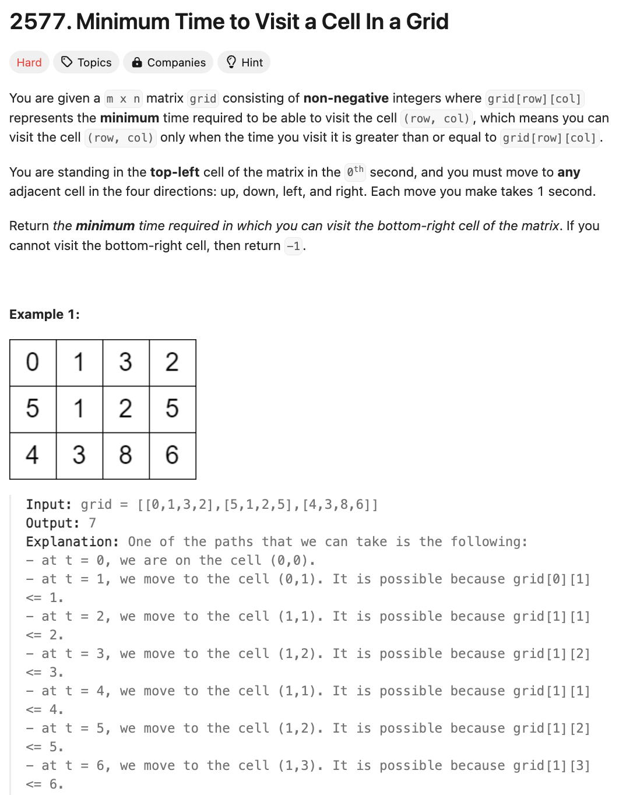
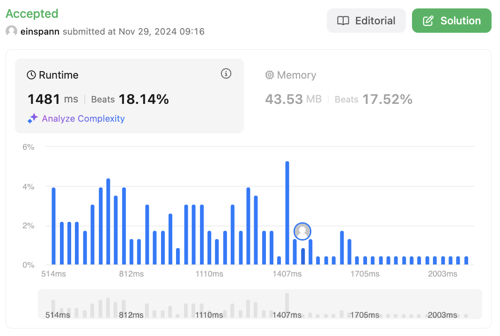

# 문제 설명
이 문제는 2차원 그리드에서 주어진 좌표를 방문하는데 걸리는 최소 시간이 주어진다. 이때, 이동은 대각선, 수평, 수직으로 이동할 수 있다. 한 칸을 이동하는데 1초가 걸린다고 가정할 때, 주어진 좌표를 방문하는데 걸리는 최소 시간을 구하는 문제이다.



## 풀이 및 해설


## 풀이
```python
class Solution:
    def minimumTime(self, grid: List[List[int]]) -> int:
        # if both initial require more than 1 sec, impossible
        if grid[0][1] > 1 and grid[1][0] > 1:
            return -1
        
        rows, cols = len(grid), len(grid[0])
        # possible movements: down, up, right, left
        directions = [(1,0), (-1,0), (0,1), (0,-1)]
        visited = set()

        # priority queue stores
        # ordered by min time to reach each cell
        pq = [(grid[0][0],0,0)]

        while pq:
            time, row, col = heapq.heappop(pq)

            # check if reached target
            if (row, col) == (rows-1, cols-1):
                return time
            
            # skip if cell already visited
            if (row, col) in visited:
                continue
            visited.add((row,col))

            # try all four directions
            for dx,dy in directions:
                next_row, next_col = row+dx, col+dy

                if not self._is_valid(visited, next_row, next_col, rows, cols):
                    continue
                
                # calculate the wait time needed to move to next cell
                wait_time = (
                    1 if (grid[next_row][next_col] - time) % 2 == 0 else 0
                )
                next_time = max(grid[next_row][next_col] + wait_time, time+1)
                heapq.heappush(pq, (next_time, next_row, next_col))
            
        return -1
    
    def _is_valid(self, visited, row, col, rows, cols):
        return 0<=row<rows and 0<=col<cols and (row, col) not in visited
```
def minimumTime:
- 오른쪽 칸과 아래 칸의 값이 1보다 크면 불가능한 경우이므로 -1을 반환한다.
- rows, cols는 grid의 행과 열의 길이를 저장한다.
- directions는 이동할 수 있는 방향을 저장한다.
- visited는 방문한 좌표를 저장한다.
- pq는 우선순위 큐로, 각 셀에 도달하는 데 걸리는 최소 시간을 저장한다.
- while pq: 루프를 돌면서
    - time, row, col = heapq.heappop(pq)로 pq에서 값을 꺼낸다.
    - 지금 도착한 셀이 목적지인지 확인한다.
    - 방문한 셀인지 확인한다.
    - 네 방향으로 이동해본다.
        - 이동할 수 없는 경우를 _is_valid로 확인하고 안된다면 continue한다.
        - 다음 셀로 이동하는데 걸리는 시간을 계산한다.
        - 다음 셀로 이동하는데 걸리는 시간을 pq에 추가한다.
        - pq는 최소 힙이므로, 최소 시간이 먼저 나오게 된다.
        - 만약 목적지에 도달하면 time을 반환한다.
- 만약 목적지에 도달하지 못하면 -1을 반환한다.

def _is_valid:
- 방문한 셀인지, 그리드를 벗어나는지 확인한다.

## Complexity Analysis


### 시간 복잡도
- O(MNlog(MN)) : pq에 추가 및 삭제하는데 log(MN)이 걸리고, 셀을 모두 방문하는데 MN이 걸린다.

### 공간 복잡도
- O(MN) : visited에 모든 셀을 저장한다.

## Constraint Analysis
```
Constraints:
m == grid.length
n == grid[i].length
2 <= m, n <= 1000
4 <= m * n <= 10^5
0 <= grid[i][j] <= 10^5
grid[0][0] == 0
```

# References
- [2577. Minimum Time to Visit a Cell In a Grid](https://leetcode.com/problems/minimum-time-to-visit-all-points/)