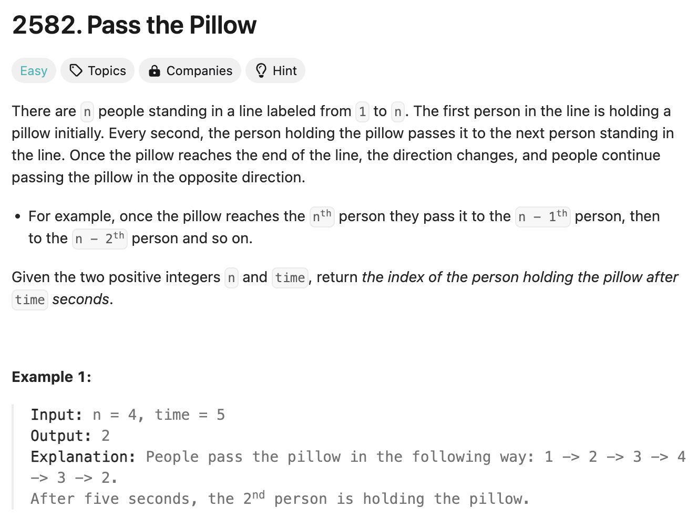

# 문제 설명
시간이 주어졌을때 마지막으로 쿠션을 받는 사람을 찾는 문제입니다.



## 풀이 및 해설

## 풀이
```python
class Solution:
    def passThePillow(self, n: int, time: int) -> int:
        cycles = time // (n-1)
        remaining_time = time % (n-1)

        if cycles % 2 == 0:
            return 1+remaining_time
        else:
            return n-remaining_time
```
- cycles는 전체 시간을 n-1로 나눈 몫입니다. 즉, 몇개의 사이클을 돌 수 있는지 계산.
- cycle을 다 돌고 나서 남는 시간 remaining_time을 계산.
- cycles가 짝수이면 1+remaining_time이 마지막으로 쿠션을 받는 사람의 번호.
- cycles가 홀수이면 n-remaining_time이 마지막으로 쿠션을 받는 사람의 번호

## Complexity Analysis


### 시간 복잡도
- O(1): cycles와 remaining_time을 계산하는데 상수 시간이 걸림.

### 공간 복잡도
- O(1): cycles와 remaining_time을 저장하는데 상수 공간이 필요.

## Constraint Analysis
```
Constraints:
2 <= n <= 1000
1 <= time <= 1000
```

# References
- [LeetCode](https://leetcode.com/problems/pass-the-pillow/)