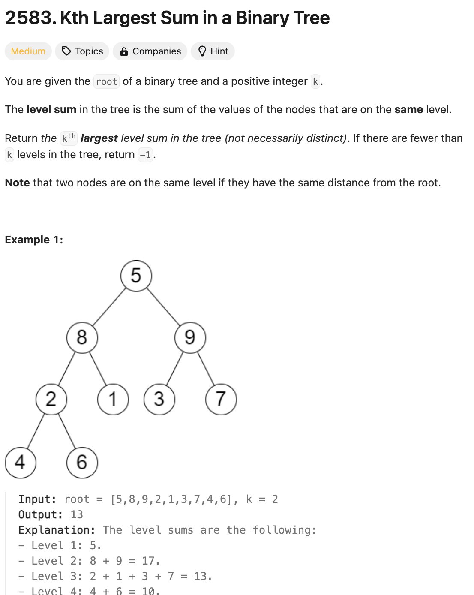

# 문제 설명
이진 트리의 각 레벨의 합을 계산하고, k번째로 큰 값을 반환하는 문제.



## 풀이 및 해설
BFS를 이용하여 각 레벨의 합을 계산하고, 이를 내림차순으로 정렬하여 k번째 값을 반환한다.

## 풀이
```python
# Definition for a binary tree node.
# class TreeNode:
#     def __init__(self, val=0, left=None, right=None):
#         self.val = val
#         self.left = left
#         self.right = right
class Solution:
    def kthLargestLevelSum(self, root: Optional[TreeNode], k: int) -> int:
        if not root:
            return -1
        
        queue = deque([root])
        level_sums = []

        while queue:
            level_size = len(queue)
            level_sum = 0

            for _ in range(level_size):
                node = queue.popleft()
                level_sum += node.val

                if node.left:
                    queue.append(node.left)
                if node.right:
                    queue.append(node.right)
            
            level_sums.append(level_sum)
            
        if k > len(level_sums):
            return -1
        
        return heapq.nlargest(k, level_sums)[-1]
```
- BFS를 이용하여 각 레벨의 합을 계산한다.
- 계산된 레벨의 합을 내림차순으로 정렬하여 k번째 값을 반환한다.
- 레벨의 합이 k보다 작을 경우 -1을 반환한다.

## Complexity Analysis


### 시간 복잡도
- 시간 복잡도는 O(n)이다.

### 공간 복잡도
- 공간 복잡도는 O(n)이다.

## Constraint Analysis
```
Constraints:
The number of nodes in the tree is n.
2 <= n <= 10^5
1 <= Node.val <= 10^6
1 <= k <= n
```

# References
- [2583. Kth Largest Sum in a Binary Tree](https://leetcode.com/problems/kth-largest-sum-in-a-binary-tree/)