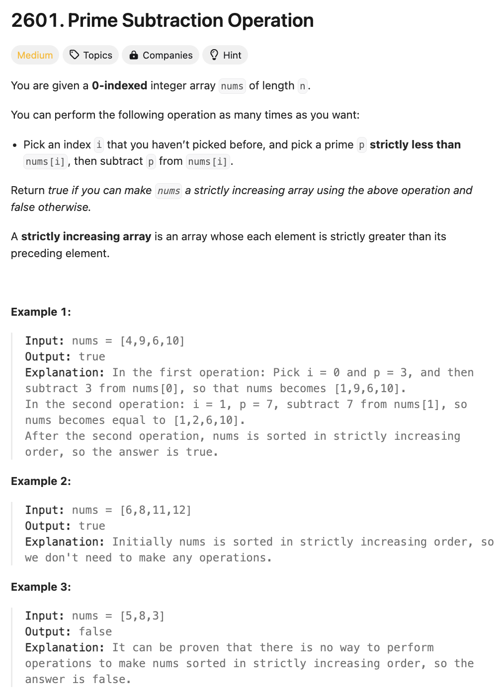
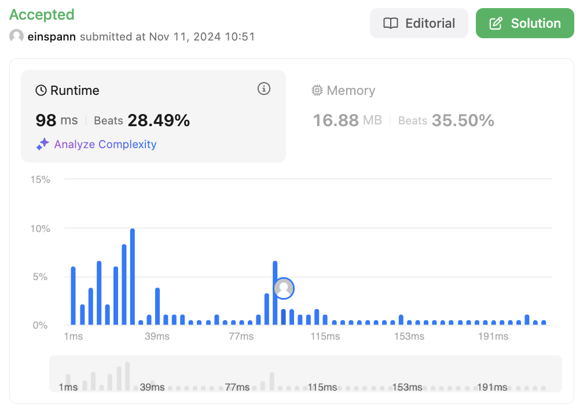

# 문제 설명
해당 문제는 nums라는 배열이 주어졌을 때, 다음이 가능한지 판단하는 문제이다.

다음 연산을 여러번 수행할 수 있다.
- 전에 선택하지 않은 인덱스 i를 선택하고, nums[i]보다 작은 소수 p를 선택하여 nums[i]에서 p를 뺀다.

이때, 최종적으로 증가하는 배열을 만들 수 있다면 True, 아니라면 False를 반환하라.



## 풀이 및 해설

## 풀이
```python
def primeSubOperation(self, nums: List[int]) -> bool:
    # generate primes up to max(nums)
    primes = []
    for i in range(2, max(nums)):
        for p in primes:
            if i % p == 0:
                break
        else:
            primes.append(i)
    
    n = len(nums)

    # iterate right to left
    for i in range(n-2, -1, -1):
        if nums[i] < nums[i+1]:
            continue
        
        # find largest prime that can be subtracted
        j = bisect_right(primes, nums[i] - nums[i+1])
        if j == len(primes) or primes[j] >= nums[i]:
            return False
        
        nums[i] -= primes[j]
    
    return True
```

## Complexity Analysis


### 시간 복잡도
- O(nlogn) ; n은 nums의 길이, logn은 소수를 찾는 시간복잡도

### 공간 복잡도
- O(n) ; n은 nums의 길이

## Constraint Analysis
```
Constraints:
1 <= nums.length <= 1000
1 <= nums[i] <= 1000
nums.length == n
```

# References
- [2601. Prime Subtraction Operation](https://leetcode.com/problems/prime-subtraction-operation/)