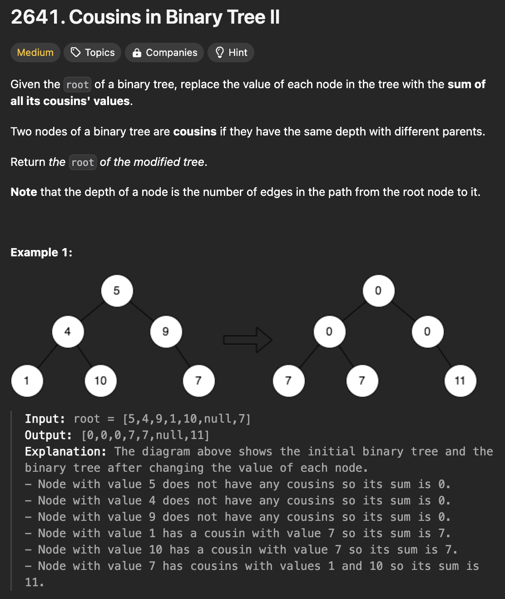

# 문제 설명

이진 트리에서 두 노드가 cousins인지 확인하라. cousins란 두 노드가 같은 깊이에 있으면서 부모가 같지 않은 경우를 말한다. 이때, cousins의 합을 구하여 현재 노드의 값을 반환하라.



## 풀이 및 해설


## 풀이
```python
# Definition for a binary tree node.
# class TreeNode:
#     def __init__(self, val=0, left=None, right=None):
#         self.val = val
#         self.left = left
#         self.right = right
class Solution:
    def replaceValueInTree(self, root: Optional[TreeNode]) -> Optional[TreeNode]:
        if not root:
            return None

        level_sums = {}

        # first pass: calculate sum for each level
        def calculate_sums(node, level):
            if not node:
                return
            level_sums[level] = level_sums.get(level,0) + node.val
            calculate_sums(node.left, level+1)
            calculate_sums(node.right, level+1)

        calculate_sums(root,0)

        # second pass: update node values
        def update_values(node, level, parent_sum):
            if not node:
                return
            
            # calculate sibling sum
            sibling_sum = 0
            if node.left:
                sibling_sum += node.left.val
            if node.right:
                sibling_sum += node.right.val
            
            # update current node's value
            cousin_sum = level_sums.get(level,0) - parent_sum
            original_val = node.val
            node.val = cousin_sum

            # recursive calls for children
            update_values(node.left, level+1, sibling_sum)
            update_values(node.right, level+1, sibling_sum)
        
        # handle root separately
        root_val = root.val
        update_values(root,0,root_val)
        root.val = 0 # root always has 0 cousins

        return root
```
- root가 존재하지 않을 경우 None을 반환한다.
- level_sums는 각 레벨의 합을 저장하는 딕셔너리이다.
- calculate_sums 함수는 각 레벨의 합을 계산한다.
  - 재귀적으로 왼쪽, 오른쪽 자식 노드를 탐색하며 level_sums에 값을 더해준다.
- update_values 함수는 노드의 값을 업데이트한다.
  - 노드가 존재하지 않을 경우 None을 반환한다.
  - sibling_sum은 현재 노드의 자식 노드의 값을 더한 값이다.
  - cousin_sum은 현재 레벨의 합에서 부모 노드의 값을 뺀 값이다.
  - original_val은 현재 노드의 원래 값이다.
  - node.val은 cousin_sum으로 업데이트한다.
  - 재귀적으로 왼쪽, 오른쪽 자식 노드를 탐색하며 sibling_sum을 전달한다.
- root_val은 root의 값이다.
- update_values 함수를 호출하여 root의 값을 업데이트한다.
- root의 값은 항상 0이다.
- root를 반환한다.

## Complexity Analysis


### 시간 복잡도
- O(N): 트리의 모든 노드를 탐색해야 하므로 O(N)이다.
  - 첫 번째 패스: O(N)
  - 두 번째 패스: O(N)
  - 따라서, O(N)이다.

### 공간 복잡도
- O(N): level_sums 딕셔너리를 사용하므로 O(N)이다.
- 따라서, O(N)이다.

## Constraint Analysis
```
Constraints:
The number of nodes in the tree is in the range [1, 10^5].
1 <= Node.val <= 10^4
```

# References
- [2641. Cousins in Binary Tree II](https://leetcode.com/problems/cousins-in-binary-tree-ii/)