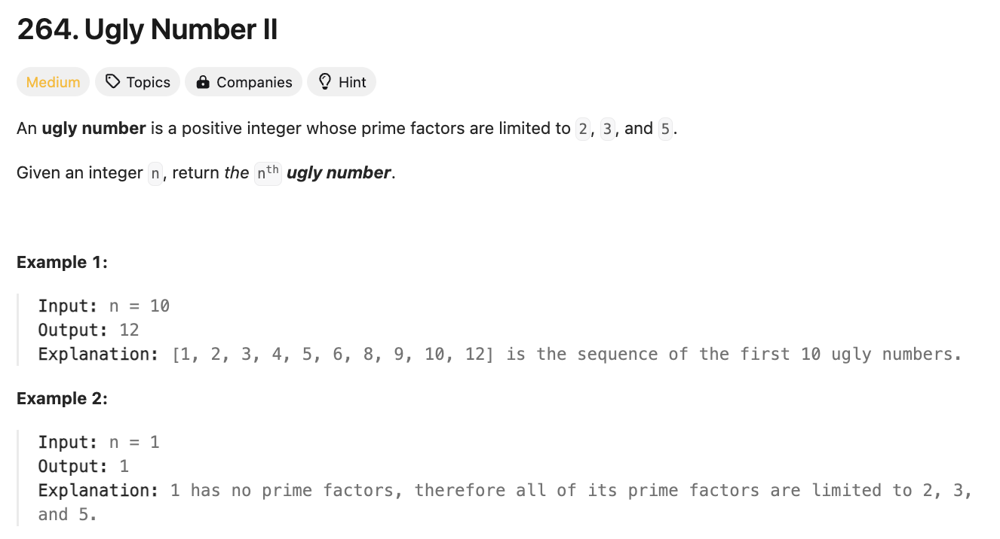

# 문제 설명
주어진 숫자 `n`번째의 Ugly Number를 찾는 문제이다.

이때, Ugly Number는 2, 3, 5로만 나누어 떨어지는 숫자를 의미한다.




## 풀이 및 해설


## 풀이
```python
def nthUglyNumber(self, n: int) -> int:
        # find prime factors of number
        ugly = [1]
        i2,i3,i5 = 0,0,0
        next_ugly = 0

        for i in range(1,n):
            next_ugly = min(ugly[i2]*2,ugly[i3]*3,ugly[i5]*5)
            ugly.append(next_ugly)

            if next_ugly == ugly[i2] * 2:
                i2 += 1
            if next_ugly == ugly[i3] * 3:
                i3 += 1
            if next_ugly == ugly[i5] * 5:
                i5 += 1
        
        return ugly[-1]
```
- ugly 리스트에 1을 넣어주고, 2,3,5의 인덱스를 0으로 초기화한다.
- ugly 리스트의 길이가 n보다 작을 때까지 반복한다.
- next_ugly는 2,3,5의 인덱스를 곱한 값 중 가장 작은 값을 넣어준다.
- next_ugly가 2의 인덱스를 곱한 값과 같다면, 2의 인덱스를 1 증가시킨다.
- next_ugly가 3의 인덱스를 곱한 값과 같다면, 3의 인덱스를 1 증가시킨다.
- next_ugly가 5의 인덱스를 곱한 값과 같다면, 5의 인덱스를 1 증가시킨다.
- 반복문이 끝나면 ugly 리스트의 마지막 값을 반환한다.


## Complexity Analysis


### 시간 복잡도
- O(n) ; n번째 Ugly Number를 찾기 위해 n번 반복한다.

### 공간 복잡도
- 공간 복잡도는 O(n)이다. n번째 Ugly Number를 찾기 위해 n개의 리스트를 사용한다.

## Constraint Analysis
```
Constraints:
1 <= n <= 1690
```

# References
- [264. Ugly Number II](https://leetcode.com/problems/ugly-number-ii/)