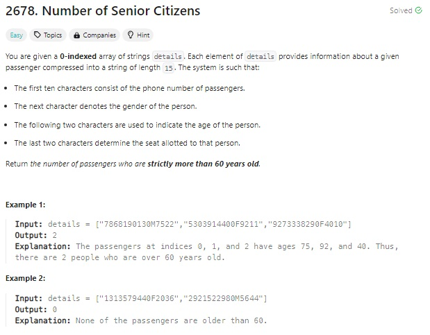

# 문제 설명
주어진 배열에서 60살 이상의 성인의 수를 구하는 문제이다.



## 풀이 및 해설

## 풀이
```python
def countSeniors(self, details: List[str]) -> int:
        # char 11,12 = age
        count = 0
        for detail in details:
            age = int(detail[11:13])
            if age > 60:
                count += 1
        
        return count
```
- count를 0으로 초기화하고, for loop으로 details 배열을 반복한다.
    - detail의 11,12번째 index를 int로 변환하여 age에 저장한다.
    - age가 60보다 크면 count를 1 증가시킨다.
- count를 반환한다.

## Complexity Analysis


### 시간 복잡도
- O(N)

### 공간 복잡도
- O(1)

## Constraint Analysis
```
Constraints:
1 <= details.length <= 100
details[i].length == 15
details[i] consists of digits from '0' to '9'.
details[i][10] is either 'M' or 'F' or 'O'.
The phone numbers and seat numbers of the passengers are distinct.
```

# References
- [2678. Number of Senior Citizens](https://leetcode.com/problems/number-of-senior-citizens/)
