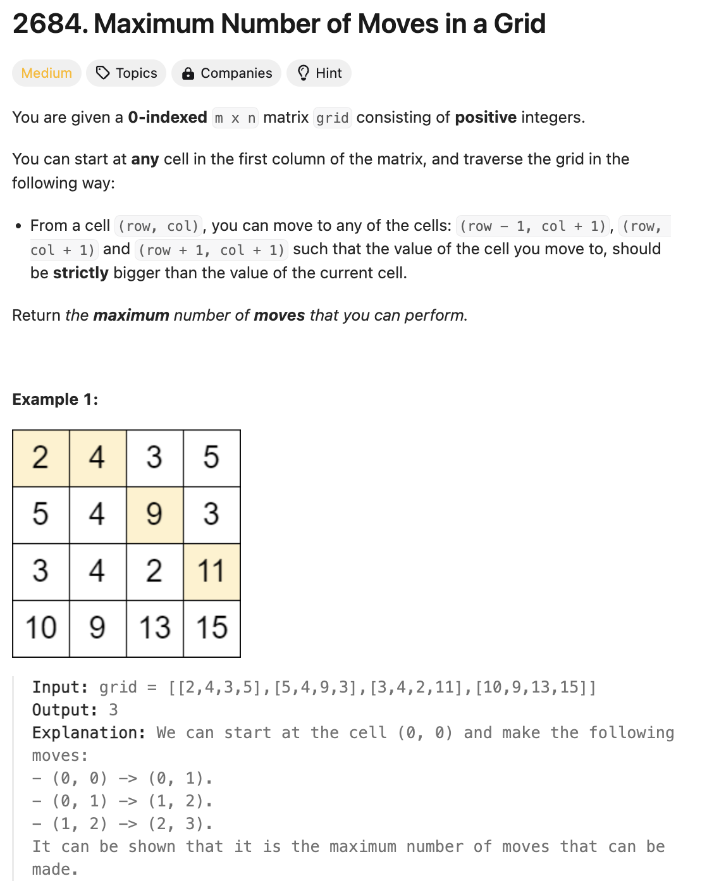

# 문제 설명
이 문제는 오른쪽, 오른쪽 위, 또는 오른쪽 아래로 움직일 수 있는 격자가 주어질 때, 최대로 이동할 수 있는 횟수를 구하는 문제이다. 단, 이동할 다음 칸의 값은 현재 칸의 값보다 커야 한다.



## 풀이 및 해설

## 풀이
```python
class Solution:
    def maxMoves(self, grid: List[List[int]]) -> int:
        m, n = len(grid), len(grid[0])
        dp = [0] * m

        for col in range(n-2,-1,-1):
            new_dp = [0]*m
            for row in range(m):
                for dr in [-1,0,1]:
                    nr = row+dr
                    if 0<=nr<m and grid[row][col] < grid[nr][col+1]:
                        new_dp[row] = max(new_dp[row], 1+dp[nr])
            dp = new_dp
        
        return max(dp)
```

## Complexity Analysis


### 시간 복잡도
- O(mn) ; m은 행의 개수, n은 열의 개수

### 공간 복잡도
- O(m) ; m은 행의 개수

## Constraint Analysis
```
Constraints:
m == grid.length
n == grid[i].length
2 <= m, n <= 1000
4 <= m * n <= 10^5
1 <= grid[i][j] <= 10^6
```

# References
- [2684. Maximum Number of Moves in a Grid](https://leetcode.com/problems/maximum-number-of-moves-in-a-grid/)