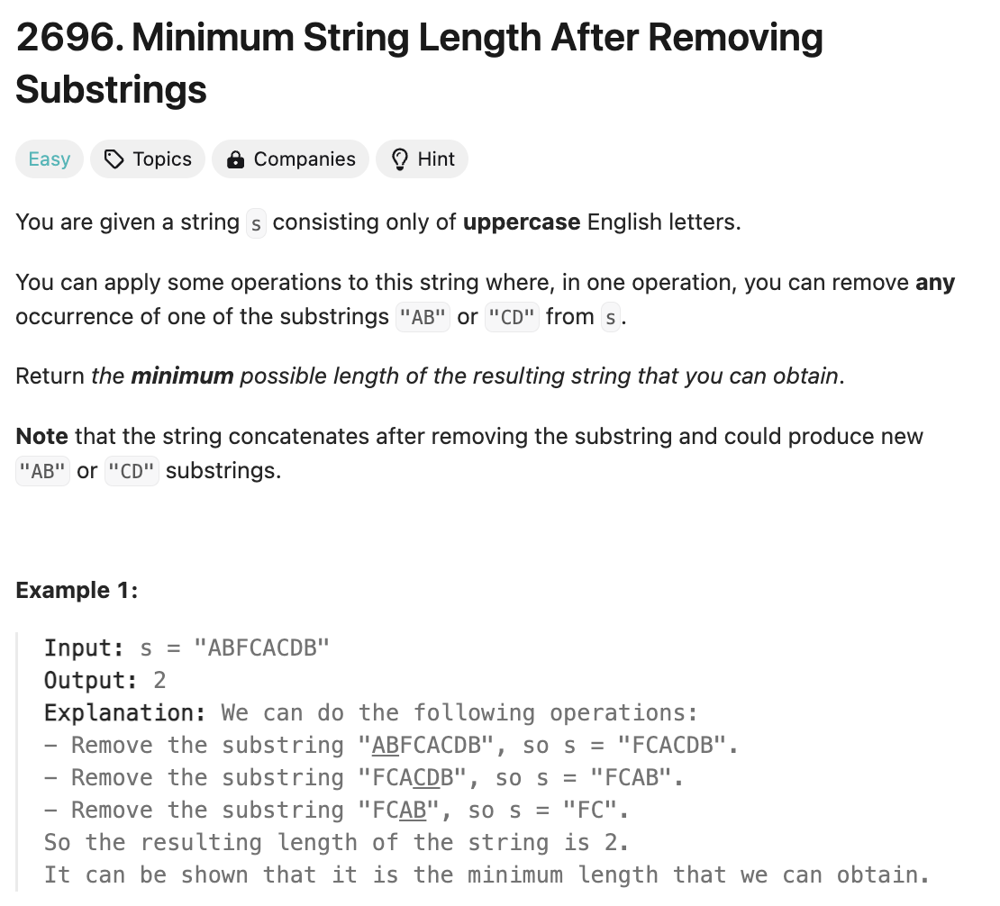

# 문제 설명
문자열 s가 주어졌을때 substring 'AB' 또는 'CD'를 제거하여 만들 수 있는 가장 짧은 문자열의 길이를 반환하라.



## 풀이 및 해설

## 풀이
```python
class Solution:
    def minLength(self, s: str) -> int:
        stack = []

        for char in s:
            if stack and ((char == 'B' and stack[-1] == 'A') or (char == 'D' and stack[-1] == 'C')):
                stack.pop()
            else:
                stack.append(char)
        

        return len(stack)
```
- stack을 유지하면서 문열을 순회한다.
- 지금 문자가 B이고, stack은 지난 문자기 때문에 A인 경우, stack에서 pop한다.
- 동일하게 문자가 D이고, stack은 C인 경우, stack에서 pop한다.
- 이렇게 해서 남는 문자열의 길이를 반환한다.

## Complexity Analysis


### 시간 복잡도
- 문자열을 순회하면서 stack을 유지하므로 O(N)이다.

### 공간 복잡도
- stack을 유지하므로 O(N)이다.

## Constraint Analysis
```
Constraints:
1 <= s.length <= 100
s consists only of uppercase English letters.
```

# References
- [2696. Minimum String Length After Removing Substrings](https://leetcode.com/problems/minimum-length-to-make-string-unique/)