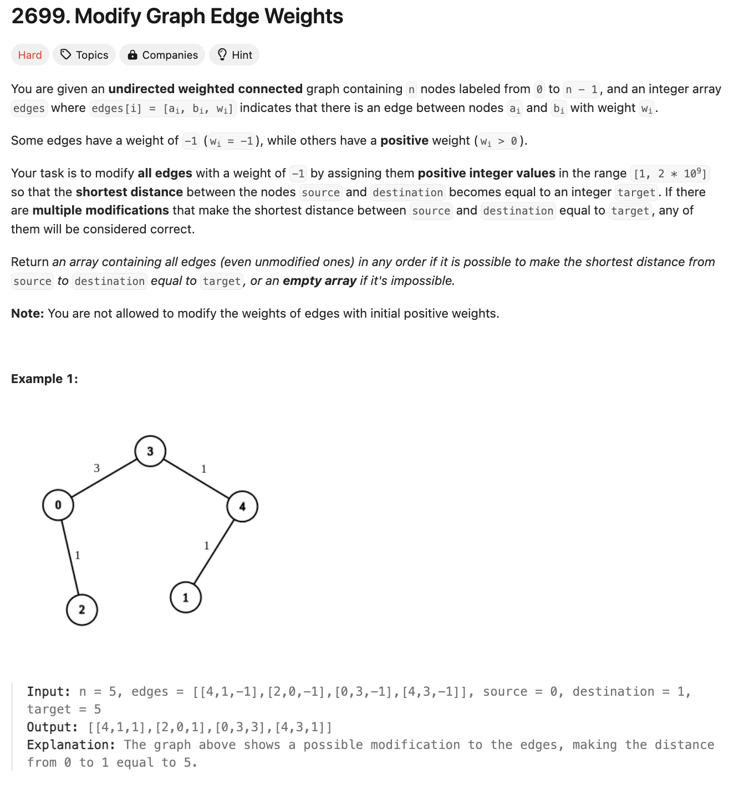
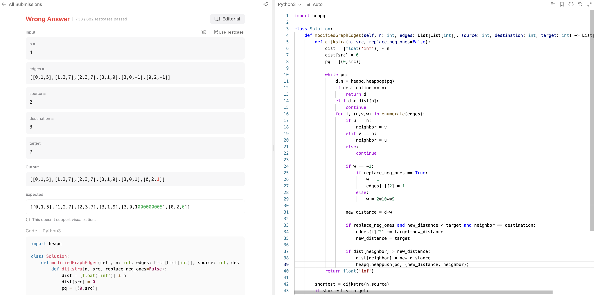

# 문제 설명
edge의 가중치가 -1로 표시된 그래프가 주어졌을 때, 시작점과 끝점 사이의 최단 거리를 구하는 문제이다.



# 첫 시도
핵심 개념은 다음과 같다.
1. dijkstra를 한번 사용하여 시작과 끝점 사이의 최단 거리를 구한다.
2. dijkstra를 한번 더 사용하여 -1로 표시된 edge의 가중치를 바꾼다.



## 코드
```python
import heapq

class Solution:
    def modifiedGraphEdges(self, n: int, edges: List[List[int]], source: int, destination: int, target: int) -> List[List[int]]:
```
- def dijkstra(source, replace_neg_ones=False) 함수를 선언한다.
    - distances를 n개의 큰 수로 초기화한다.
    - distances[source]를 0으로 초기화한다.
    - pq를 선언하고, (0, source)를 추가한다.

    - pq가 빌 때까지 다음을 반복한다.
        - distance, node를 pq에서 pop한다.
        - 끝점이 node와 같다면 distance를 반환한다.
        - distance가 distances[node]보다 크다면 continue한다.
        - edge의 이웃들 i,(u,v,w)를 순회하며 다음을 반복한다.
            - u가 node와 같다면
                - neighbor은 v
            - v가 node와 같다면
                - neighbor은 u
            - else continue
            - weight가 -1라면
                - replace_neg_ones가 True라면
                    - weight를 1로 바꾼다.
                    - edges[i][2]를 1로 바꾼다.
                - else weight를 큰 수 (2*10**9)로 바꾼다.
            
            - new_distance는 distance + weight

            # 특별한 경우: 딱 맞게 도달하는 경우
            - replace_neg_ones가 True이고, new_distance가 target보다 작고, neighbor이 destination 같다면
                - edges[i][2]에 target-new_distance를 더한다.
                - new_dist는 target
            - dist[neighbor]가 new_distance보다 크다면
                - dist[neighbor]를 new_distance로 바꾼다.
                - pq에 pq, (new_distance, neighbor)를 추가한다.
    
    - 끝까지 도달하지 못할 경우 inf를 반환한다.

- 첫번째 dijkstra를 호출하여 최단경로를 찾는다.
- 최단경로가 target보다 작으면 []를 반환한다. 이미 큰 수로 채워진 최단경로보다 더 작을 수 없기 때문이다.
- 최단경로가 target과 똑같다면 배열으로 바꾸어 반환하고, -1이 존재한다면 1로 바꾸어 반환한다.

- 두번째 dijkstra를 호출하여 -1로 표시된 edge의 가중치를 바꾼다.
- 최단경로가 target과 같을 경우 edges를 반환한다.
- 이 모든 과정을 거치고도 target에 도달하지 못한 경우 바로 []를 반환한다.

## 해설 및 풀이
- 두 번의 다익스트라 알고리즘 실행
    - 첫 번째는 목적지에서 시작하여 음수 가중치 간선을 무시
    - 두 번째는 출발지에서 시작하여 음수 가중치 간선을 1로 취급

# 풀이

```python
from heapq import heappush, heappop
from collections import defaultdict
from math import inf

class Solution:
    def modifiedGraphEdges(self, n: int, edges: List[List[int]], source: int, destination: int, target: int) -> List[List[int]]:
        adj = [[] for _ in range(n)]
        for u, v, w in edges:
            adj[u].append([v, w])
            adj[v].append([u, w])
        
        def dijkstra(source, adj, skip_negative):
            pq = [[0, source]]
            dist = defaultdict(lambda: inf)
            dist[source] = 0
            parent = {}
            while pq:
                d, node = heappop(pq)
                if d > dist[node]:
                    continue
                for nei, w in adj[node]:
                    if w == -1:
                        if skip_negative:
                            continue
                        w = 1

                    d2 = d + w
                    if d2 < dist[nei]:
                        dist[nei] = d2
                        parent[nei] = node
                        heappush(pq, [d2, nei])

            return dist, parent
        
        distR, parentR = dijkstra(destination, adj, skip_negative=True)
        if distR.get(source, inf) < target:
            return []
        dist, parent = dijkstra(source, adj, skip_negative=False)
        if dist[destination] > target:
            return []
        
        path = [destination]
        while path[-1] != source:
            path.append(parent[path[-1]])
        path = path[::-1]
        
        edges = {(min(u,v), max(u,v)): w for u, v, w in edges}
        
        walked = 0
        for u, v in zip(path, path[1:]):
            e = (min(u, v), max(u, v))
            if edges[e] == -1:
                edges[e] = max(target - distR.get(v, inf) - walked, 1)
                if edges[e] > 1:
                    break
            walked += edges[e]
        
        for e, w in edges.items():
            if w == -1:
                edges[e] = 2 * (10 ** 9)
        
        return [[u,v,w] for (u,v), w in edges.items()]
```

## Complexity Analysis


### 시간 복잡도
- O(ElogV) ; E는 edge의 개수, V는 vertex의 개수

### 공간 복잡도
- O(V+E) ; E는 edge의 개수, V는 vertex의 개수

## Constraint Analysis
```
Constraints:
1 <= n <= 100
1 <= edges.length <= n * (n - 1) / 2
edges[i].length == 3
0 <= ai, bi < n
wi = -1 or 1 <= wi <= 10^7
ai != bi
0 <= source, destination < n
source != destination
1 <= target <= 10^9
The graph is connected, and there are no self-loops or repeated edges.
```

# References
- [2699. Modify Graph Edge Weights](https://leetcode.com/problems/modify-graph-edge-weights/)