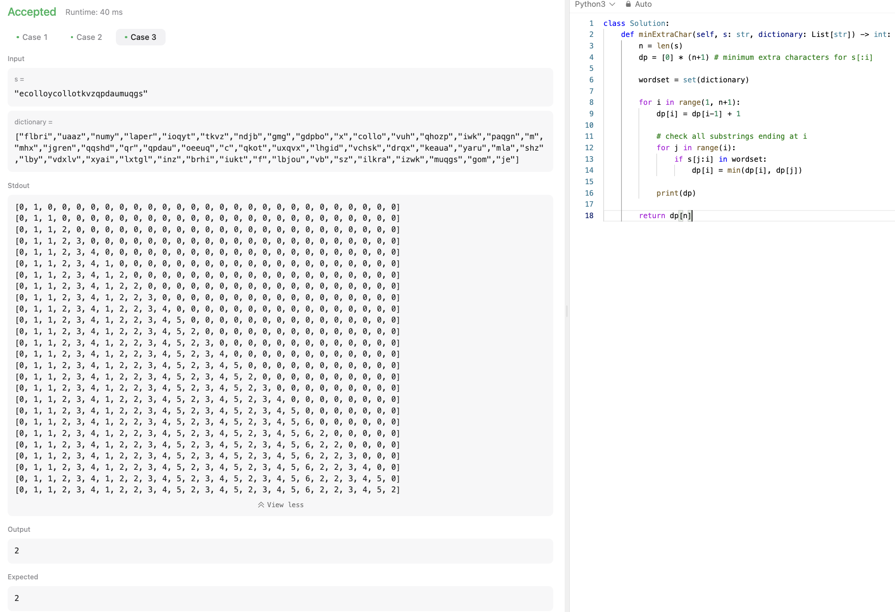

# 문제 설명
단어 사전과 단어 s가 주어질 때, s를 이상적으로 substring으로 나눠서 단어 사전에 있는 단어로 만들었을 경우, 남는 문자열의 길이를 반환하라.


# 1차 시도

## 풀이 및 해설
일단은 간단하게 문자열 s에 대한 모든 substring에 대해서 dictionary에 존재하는지 한번 순회하면서 확인하고, 만약에 존재한다면 s를 업데이트하는 방향으로 해봤다.

다만, 해당 방법은 최단 길이 s를 고려하지 않고 앞에 나타나는 substring를 우선적으로 바로 삭제하기 때문에 틀릴 가능성이 높다.

## 풀이
```python
def minExtraChar(self, s: str, dictionary: List[str]) -> int:
    n = len(s)
    i = 0
    # remove from string if substring is in dictionary
    while i < n:
        found = False
        for j in range(i+1, n+1):
            if s[i:j] in dictionary:
                s = s[:i] + s[j:]
                n = len(s)
                found = True
                break
        if not found:
            i += 1
    
    print(s)
    return len(s)
```


테스트는 통과했지만, 역시 최적화가 안되어 있기 때문에 통과하진 못했다. 아마 DP로 최단 길이를 찾아봐야 할것 같다.

# 2차 시도

## 풀이 및 해설
이번에는 DP로 풀어봤다. dp[i]를 우선 dp[i-1]+1으로 설정하면, 이전의 최소 글자로부터 하나 증가시켜서, 이 글자는 딕셔너리에서 줄일 수 없다고 해놓는다.

이후, i까지의 모든 substring에 대해서 딕셔너리에 존재하는지 확인하고, 만약 존재한다면 dp[j]로 업데이트한다. 이때, dp[j]는 dp[i]보다 작을 수 있으므로, min(dp[i], dp[j])로 업데이트한다.

## 풀이
```python
def minExtraChar(self, s: str, dictionary: List[str]) -> int:
    n = len(s)
    dp = [0] * (n+1) # minimum extra characters for s[:i]
    
    wordset = set(dictionary)
    
    for i in range(1, n+1):
        dp[i] = dp[i-1] + 1

        # check all substrings ending at i    
        for j in range(i):
            if s[j:i] in wordset:
                dp[i] = min(dp[i], dp[j])
        
        print(dp)
    
    return dp[n]
```




## Complexity Analysis


### 시간 복잡도
- outer loop: O(n)
- inner loop: O(n)
- substring check: O(n) ; s[j:i]
- lookup in set: O(1)

따라서, O(n^3)이다.

### 공간 복잡도
- dp: O(n)
- wordset: O(m)

따라서, O(n+m)이다.

## Constraint Analysis
```
Constraints:
1 <= s.length <= 50
1 <= dictionary.length <= 50
1 <= dictionary[i].length <= 50
dictionary[i] and s consists of only lowercase English letters
dictionary contains distinct words
```

# References
- [2707. Extra Characters in a String](https://leetcode.com/problems/extra-characters-in-a-string/)