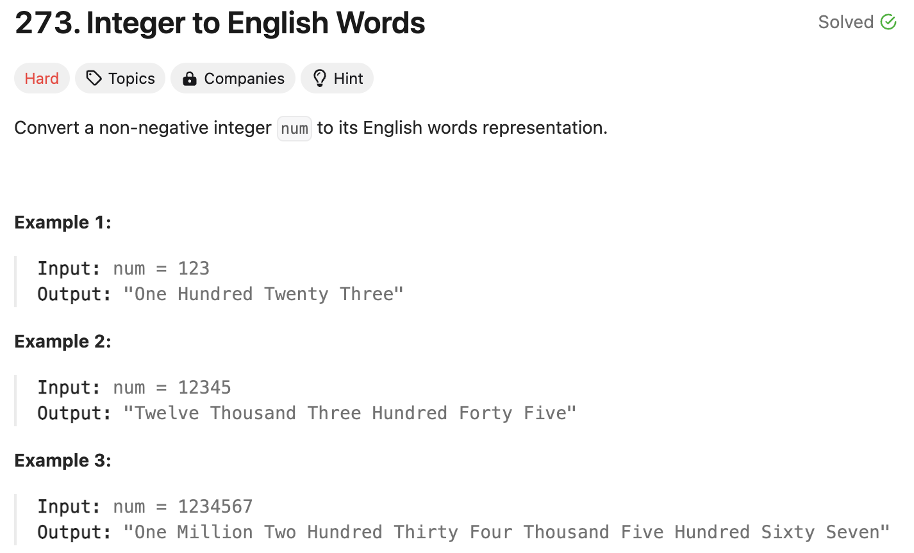
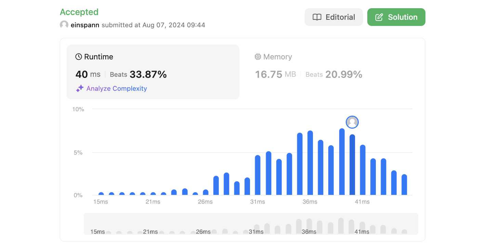

# 문제 설명
정수를 영어로 변환하는 문제다.



## 첫인상
어려움으로 분류된 문제 중에 이렇게 짧은 설명은 처음 봐서 상당히 강렬하다. 조금만 생각해봐도 구현해야 할 부분이 꽤 많아보인다. 

일단 정수를 영어로 변환하는 것 자체가 어려운데, 이걸 하는데 있어서도 3자리마다 단위를 붙여야 한다. 그리고 3자리마다 단위를 붙이는 것도 꽤 복잡해보인다. 이걸 어떻게 해결해야 할지 고민이 많이 필요해보인다.

## 풀이 및 해설

## 풀이
```python
def numberToWords(self, num: int) -> str:
        if num == 0:
            return "Zero"
        
        ones = ["", "One", "Two", "Three", "Four", "Five", "Six", "Seven", "Eight", "Nine", "Ten",
        "Eleven", "Twelve", "Thirteen", "Fourteen", "Fifteen", "Sixteen", "Seventeen", "Eighteen", "Nineteen"]
        tens = ["", "", "Twenty", "Thirty", "Forty", "Fifty", "Sixty", "Seventy", "Eighty", "Ninety"]
        thousands = ["", "Thousand", "Million", "Billion"]

        def helper(n):
            if n==0:
                return []
            if n<20:
                return [ones[n]]
            if n<100:
                return [tens[n//10]] + helper(n%10)
            if n<1000:
                return [ones[n//100], "Hundred"] + helper(n%100)
            
            for i,w in enumerate(thousands):
                if n<1000**(i+1):
                    return helper(n//1000**i) + [w] + helper(n%1000**i)
                
        
        return " ".join([w for w in helper(num) if w])
```
- 0이면 "Zero"를 반환한다.
- 1의 자리수를 나타내는 배열 ones, 10의 자리수를 나타내는 배열 tens, 1000의 자리수를 나타내는 배열 thousands를 만든다.
- helper 함수를 만들어 재귀적으로 숫자를 변환한다.
- helper 함수는 0이면 빈 배열을 반환한다.
- 20보다 작으면 ones 배열에서 값을 가져온다.
- 100보다 작으면 tens 배열에서 값을 가져오고, 나머지를 helper 함수에 넣어 재귀적으로 호출한다.
- 1000보다 작으면 ones 배열에서 100의 자리수를 가져오고, "Hundred"를 붙인다. 나머지를 helper 함수에 넣어 재귀적으로 호출한다.
- 1000의 제곱수보다 작으면 1000의 제곱수로 나눈 몫을 helper 함수에 넣고, thousands 배열에서 값을 가져온다. 나머지를 helper 함수에 넣어 재귀적으로 호출한다.
- helper 함수에서 반환된 배열을 join하여 반환한다.

## Complexity Analysis


### 시간 복잡도
- O(1) ; 상수 시간이 걸린다.

### 공간 복잡도
- O(1) ; 상수 공간이 필요하다.

## Constraint Analysis
```
Constraints:
0 <= num <= 2^31 - 1
```

# References
- [Leet 273](https://leetcode.com/problems/integer-to-english-words/)