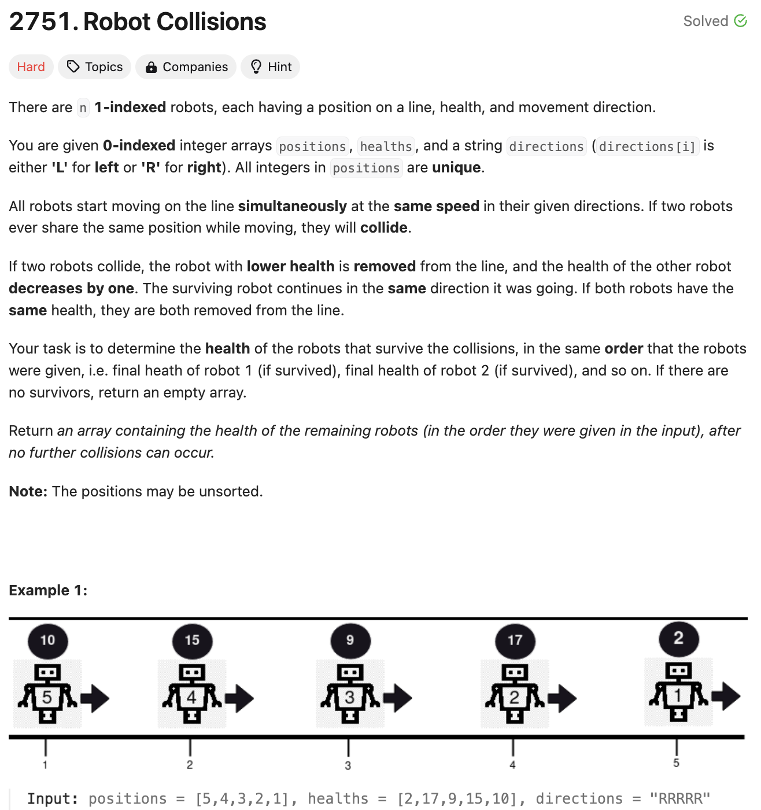
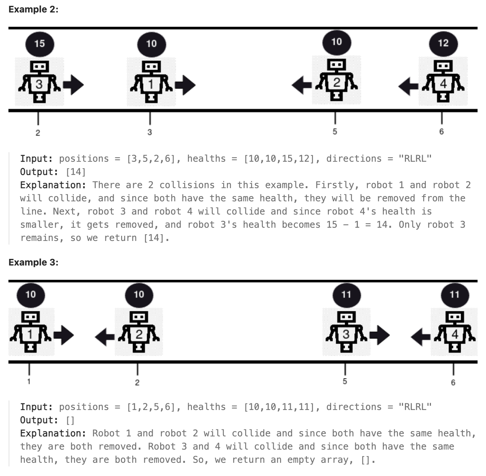

# 문제 설명
로봇이 움직이는 방향과 생명력이 주어졌을 때, 로봇이 충돌하는지 판단하고, 최종적으로 살아남는 로봇을 반환하는 문제다.




## 풀이 및 해설
이 문제를 봤을때 자칫하면 엄청 느려질 수 있겠다 싶었다. 충돌하는 여부를 무조건 찾아야 하기 때문에 while 문을 막 쓰면 시간복잡도가 엄청 높아질 수 있기 때문이다. 그런 경우를 피하기 위해 최대한 효율적이고 빠른 방식이 무엇이 있을까 생각해보았다.

일단, 충돌이 일어나지 않는 경우에 대해서는 이후 계산이 일어나지 않도록 경우의 수를 파악해봤다.
- Case 1: (no collision) they are all going in the same direction
- Case 2: (no collision) opposite directions positioned in opposite sides
- Case 3: (collision) opposite directions facing towards each other

1번 경우나 2번 경우에 해당하면 3을 굳이 안해도 될것 같다는 예상을 했다. 그래서 3번 경우에 대해서만 생각해보았다.

그러나, 3번을 풀면서 2번도 결국에 같이 풀리기 때문에 1번만 따로 처리해주게 됐다.

## 풀이
```python
class Solution:
    def survivedRobotsHealths(self, positions: List[int], healths: List[int], directions: str) -> List[int]:
        # need to check if the robots collide
        # case 1: (no collision) they are all going in the same direction
        if all(d  == 'R' for d in directions) or all(d  == 'L' for d in directions):
            return healths

        # case 2: (no collision) opposite directions positioned in opposite sides
        # case 3: (collision) opposite directions facing towards each other
        # condition: need to return health of surviving robots IN THE SAME ORDER as the healths
        # were originally given.

        # create list of robots
        # enumerate keeps track of original indices
        robots = list(enumerate(zip(positions, healths, directions)))
        
        # sort by position first, then by indices
        robots.sort(key=lambda x:x[1][0])
        
        stack = []
        survivors = [0] * len(robots)

        for i, (pos,health,direction) in robots:
            if direction == 'R':
                stack.append([i,health])
            else: # direction == 'L'
                while stack and health > 0:
                    if stack [-1][1] < health:
                        stack.pop()
                        health -= 1
                    elif stack[-1][1] > health:
                        stack[-1][1] -= 1
                        health = 0
                    else:
                        stack.pop()
                        health = 0
                
                # add remaining robots moving 'L' to survivors
                if health > 0:
                    survivors[i] = health

        # add any remaining robots moving 'R' to survivors        
        for i, health in stack:
            survivors[i] = health
        
        
        return [h for h in survivors if h > 0]
```
### 해설
- 모든 로봇들이 왼쪽으로 가거나 오른쪽으로 가는 경우에 대해서는 바로 healths를 반환한다.
- 로봇들에 대하여 위치, 생명력, 방향을 가지고 있는 리스트를 만들어준다.
- 위치를 기준으로 정렬을 해준다.
- stack을 만들어서 오른쪽으로 가는 로봇들을 넣어준다.
- 왼쪽으로 가는 로봇들에 대하여 stack에 있는 로봇들과 충돌이 일어나는지 확인한다.
    - stack에 있는 로봇들의 생명력이 현재 로봇의 생명력보다 작으면 stack에서 pop을 해준다.
    - stack에 있는 로봇들의 생명력이 현재 로봇의 생명력보다 크면 stack에 있는 로봇의 생명력을 1 줄여주고 현재 로봇의 생명력을 0으로 만들어준다.
    - stack에 있는 로봇들의 생명력이 현재 로봇의 생명력과 같으면 stack에서 pop을 해주고 현재 로봇의 생명력을 0으로 만들어준다.
    - 현재 로봇의 생명력이 0보다 크면 survivors에 현재 로봇의 생명력을 넣어준다. 즉, 살아남은 왼쪽을 가는 로봇들을 survivors에 넣어준다.
- stack에 남아있는 오른쪽으로 가는 로봇들을 survivors에 넣어준다.
- survivors에 있는 로봇들의 생명력이 0보다 큰 경우에 대해서만 반환한다.

## Complexity Analysis


### 시간 복잡도
- 로봇들을 정렬하는데 O(nlogn)이 걸린다.
- 로봇들을 순회하면서 stack에 넣고 빼는데 O(n)이 걸린다.
- 따라서, O(nlogn) + O(n) = O(nlogn)이 걸린다.

### 공간 복잡도
- 로봇들을 저장하는데 O(n)이 걸린다.
- stack을 사용하는데 O(n)이 걸린다.
- survivors를 사용하는데 O(n)이 걸린다.
- 따라서, O(n)이 걸린다.

## Constraint Analysis
```
Constraints:
1 <= positions.length == healths.length == directions.length == n <= 10^5
1 <= positions[i], healths[i] <= 10^9
directions[i] == 'L' or directions[i] == 'R'
All values in positions are distinct
```

# References
- [2751. Robot Collisions](https://leetcode.com/problems/robot-collisions/)