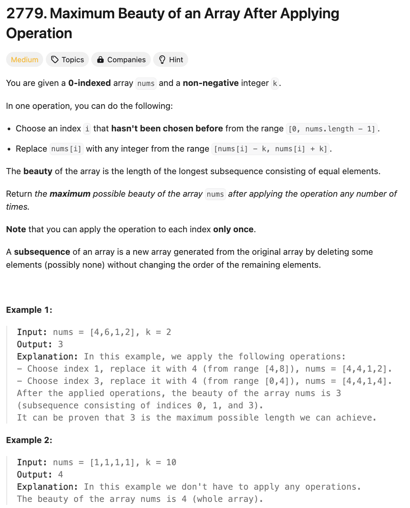
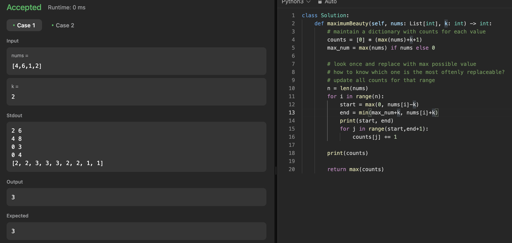

# 문제 설명
이 문제는 다음 연산을 수행했을 때, 가장 큰 beauty를 구하는 문제이다. 이때, beauty는 동일한 숫자가 여러번 나오는 subsequence이다.

연산:  
- nums의 두 숫자를 선택한다. (nums[i], nums[j])
- 숫자를 [nums[i]-k, nums[i]+k] 사이의 값으로 바꿀 수 있다.



## 풀이 및 해설

### 1차 풀이


테케는 다 통과했으나, TLE로 실패. 어떻게 더 빨리 할 수 있을까? 아무래도 for loop 두개 돌리면서 느려지는것 같긴 하다.

이를 어떻게 더 빠르게 쓸 수 있을지 고민하다가, difference array를 선택하게 되었다. 이는 제일 먼저 앞에 나온 수를 더하고, 마지막 나온 수를 빼는 방식으로 구현할 수 있다.  
그렇게 한다면 O(n)으로 구현이 가능하다.

## 풀이
```python
class Solution:
    def maximumBeauty(self, nums: List[int], k: int) -> int:
        # Handle edge case where nums is empty
        if not nums:
            return 0
        
        max_num = max(nums)
        # Initialize counts and a difference array
        counts = [0] * (max_num + k + 2)  # One extra for boundary handling
        n = len(nums)

        # Update the difference array based on each number in nums
        for i in range(n):
            start = max(0, nums[i] - k)
            end = min(max_num + k, nums[i] + k)
            counts[start] += 1          # Increment at start index
            counts[end + 1] -= 1        # Decrement just past end index

        # Apply the difference array to get the actual counts
        for i in range(1, len(counts)):
            counts[i] += counts[i - 1]

        # The maximum value in counts is the answer
        return max(counts)
```

## Complexity Analysis


### 시간 복잡도
- O(n) : nums의 길이만큼 for loop을 돌아야 하므로 O(n)이다.

### 공간 복잡도
- O(n) : counts 배열을 nums의 최대값 + k + 2만큼 사용하므로 O(n)이다.

## Constraint Analysis
```
Constraints:
1 <= nums.length <= 10^5
0 <= nums[i], k <= 10^5
```

# References
- [2779. Maximum Beauty of an Array After Applying Operation](https://leetcode.com/problems/maximum-beauty-of-an-array-after-applying-operations/)