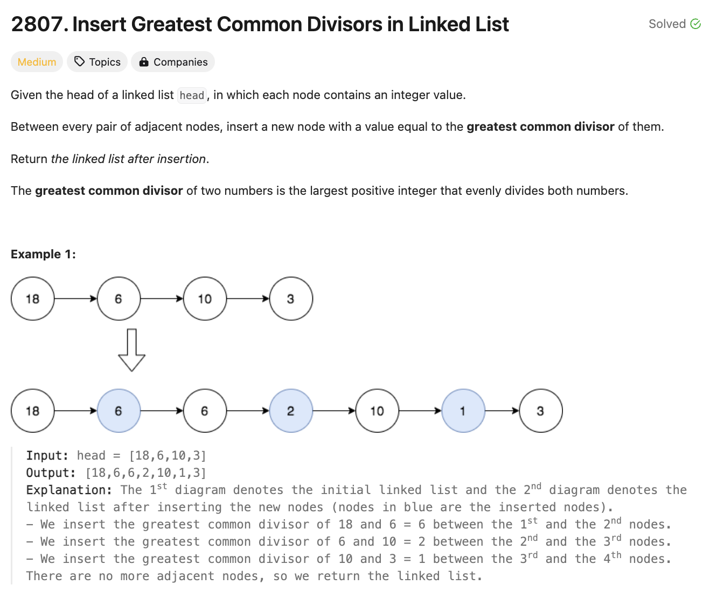

# 문제 설명
주어진 연결 리스트의 각 노드 사이에 최대공약수를 삽입하는 문제다.



## 풀이 및 해설

## 풀이
```python
import math

# Definition for singly-linked list.
# class ListNode:
#     def __init__(self, val=0, next=None):
#         self.val = val
#         self.next = next
class Solution:
    def insertGreatestCommonDivisors(self, head: Optional[ListNode]) -> Optional[ListNode]:
        current = head
        while current and current.next:
            gcd = math.gcd(current.val, current.next.val)
            between = ListNode(gcd)
            between.next = current.next
            current.next = between
            current = current.next.next
        
        return head
```
- gcd를 구하는 `math.gcd`를 사용하여 두 노드의 최대공약수를 구한다.
- 최대공약수를 삽입할 노드를 생성하고, `current.next`에 연결한다.
- `current`를 `current.next.next`로 이동한다.
- 연결 리스트의 끝까지 반복한다.
- 최종적으로 연결 리스트의 헤드를 반환한다.

## Complexity Analysis


### 시간 복잡도
- gcd 함수는 log(M)을 소요한다. 여기서 M = max(a, b)이다.
- 따라서, 전체 시간 복잡도는 O(NlogM)이다.

### 공간 복잡도
- 추가적인 공간을 사용하지 않으므로 O(1)이다.

## Constraint Analysis
```
Constraints:
- The number of nodes in the list is in the range [2, 1000].
```

# References
- [2807. Insert Greatest Common Divisors in Linked List](https://leetcode.com/problems/insert-greatest-common-divisors-in-an-array/)