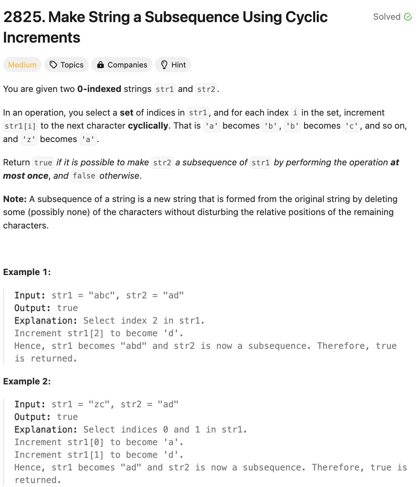

# 문제 설명
이 문제는 문자열 str1와 str2가 주어졌을때, str1의 문자를 1칸 증가하여 str2가 subsequence가 되도록 만들 수 있는지 여부를 판단하는 문제이다.



## 풀이 및 해설

## 풀이
```python
class Solution:
    def canMakeSubsequence(self, str1: str, str2: str) -> bool:
        index = 0
        for char in str1:
            next_char = 'a' if char == 'z' else chr(ord(char)+1)
            if index < len(str2) and str2[index] in (char, next_char):
                index += 1
        return index == len(str2)
```

## Complexity Analysis


### 시간 복잡도
- O(N)

### 공간 복잡도
- O(1)

## Constraint Analysis
```
Constraints:
1 <= str1.length <= 10^5
1 <= str2.length <= 10^5
str1 and str2 consist of only lowercase English letters.
```

# References
- [2825. Make String a Subsequence Using Cyclic Increments](https://leetcode.com/problems/make-string-a-subsequence-using-cyclic-increments/)