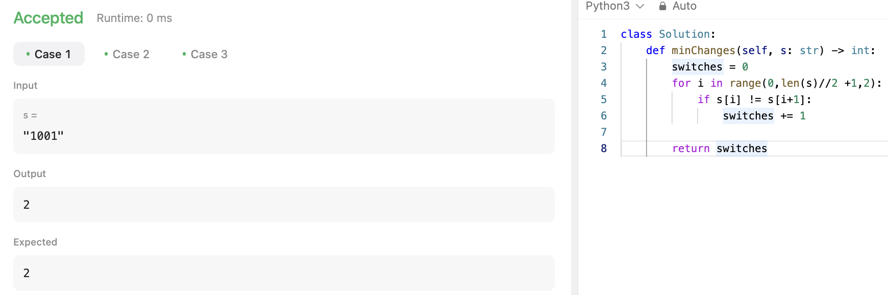

# 문제 설명
이 문제는 이진 문자열이 주어지면, 이진 문자열을 아름답게 만들기 위해 변경해야 하는 최소 횟수를 구하는 문제이다.

아름다운 이진 문자열은 다음과 같은 조건을 만족해야 한다.
- 문자열의 길이가 짝수여야 한다.
- 문자열의 0으로만 이루어져있거나, 1으로만 이루어져야 한다.

이때, 0을 1로, 1을 0으로 변경할 수 있다.


## 풀이 및 해설

### 아이디어 1
일단 짝수인 이점을 살려서, for loop의 step 크기를 2로 설정하여, 두 쌍이 다를때마다 카운트를 증가시켜봤다.  
해당 방법은 다음과 같이 테케는 성공했지만, 실제 제출 시에 틀렸다.

 

보니까 아이디어는 맞는데, loop가 이상하게 돌고 있었다.  


이번에도 참고 안하고 풀 수 있었다. 기분 좋다.

## 풀이
```python
def minChanges(self, s: str) -> int:
    switches = 0
    for i in range(0,len(s)-1,2):
        if s[i] != s[i+1]:
            switches += 1
    
    return switches
```

## Complexity Analysis


### 시간 복잡도
- O(N) : 문자열의 길이만큼 loop를 돌아야 한다.

### 공간 복잡도
- O(1) : 추가적인 공간이 필요하지 않다.

## Constraint Analysis
```
Constraints:
2 <= s.length <= 10^5
s has an even length.
s[i] is either '0' or '1'.
```

# References
- [2914. Minimum Number of Changes to Make Binary String Beautiful](https://leetcode.com/problems/minimum-number-of-changes-to-make-binary-string-beautiful/)