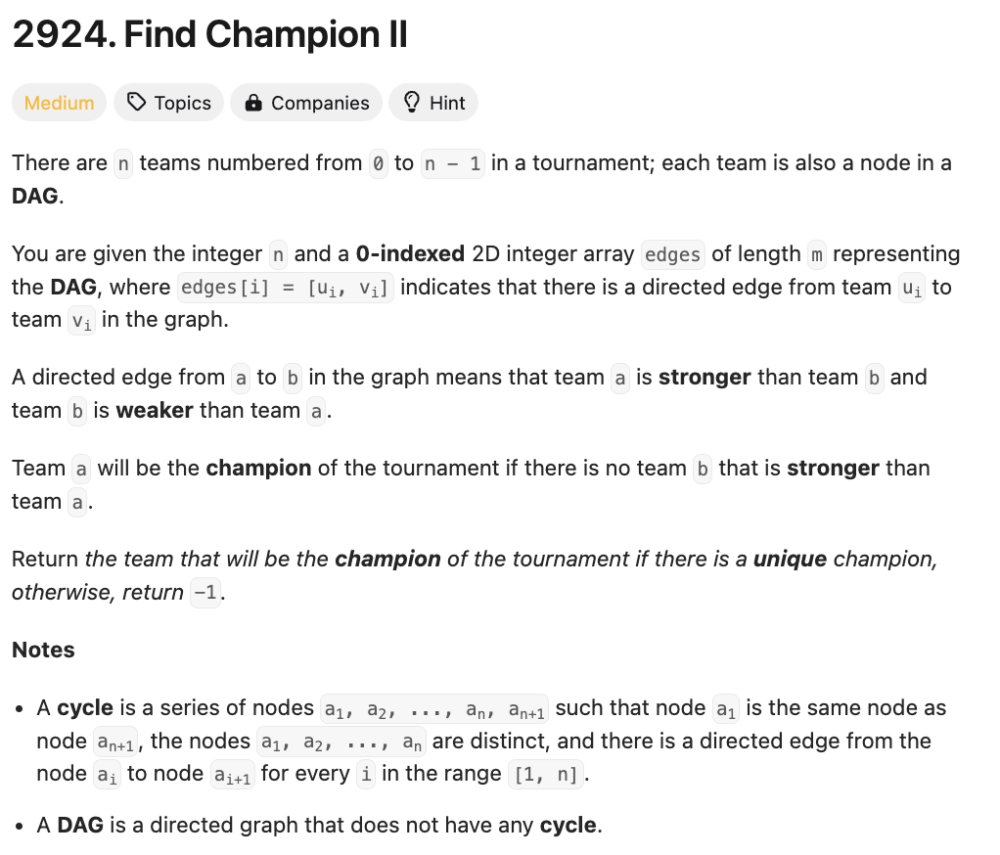

# 문제 설명
이 문제는 DAG 구조의 그래프에서 a->b로 가는 edge가 주어지면, a가 b보다 강하다는 뜻이 된다. 그렇다면 이때 가장 강한 노드를 찾는 문제이다. 단, 여러개의 노드가 가장 강할 경우 -1을 반환한다.



## 풀이 및 해설
이 문제를 풀기 위해서는 가장 강한 노드가 지는 경우가 없을것이라 생각하고 이를 0으로 만들어야 한다고 생각했다. 따라서, 모든 edge에 대해서 도착 지점이 발생할때마다 +1를 딕셔너리에 추가하는 형식으로 했다. 다만, 이는 그래프가 복잡해지고 가장 강한 노드조차 한번 정도는 지는 경우에 대해서는 처리하지 못할것이다.

## 풀이
```python
class Solution:
    def findChampion(self, n: int, edges: List[List[int]]) -> int:
        node_dict = dict.fromkeys(range(n), 0)
        for edge in edges:
            u,v = edge[0],edge[1]
            node_dict[v] += 1
        
        # if there is a single node with value 0, return it's key, else return -1
        zero_keys = [key for key,value in node_dict.items() if value ==0]
        return zero_keys[0] if len(zero_keys) == 1 else -1
```

## Complexity Analysis


### 시간 복잡도
- O(n+m) : n은 노드의 개수, m은 edge의 개수이다.

### 공간 복잡도
- O(n) : n은 노드의 개수이다.

## Constraint Analysis
```
Constraints:
1 <= n <= 100
m == edges.length
0 <= m <= n * (n - 1) / 2
edges[i].length == 2
0 <= edge[i][j] <= n - 1
edges[i][0] != edges[i][1]
The input is generated such that if team a is stronger than team b, team b is not stronger than team a.
The input is generated such that if team a is stronger than team b and team b is stronger than team c, then team a is stronger than team c.
```

# References
- [2924. Find Champion II](https://leetcode.com/problems/find-champion-ii/)