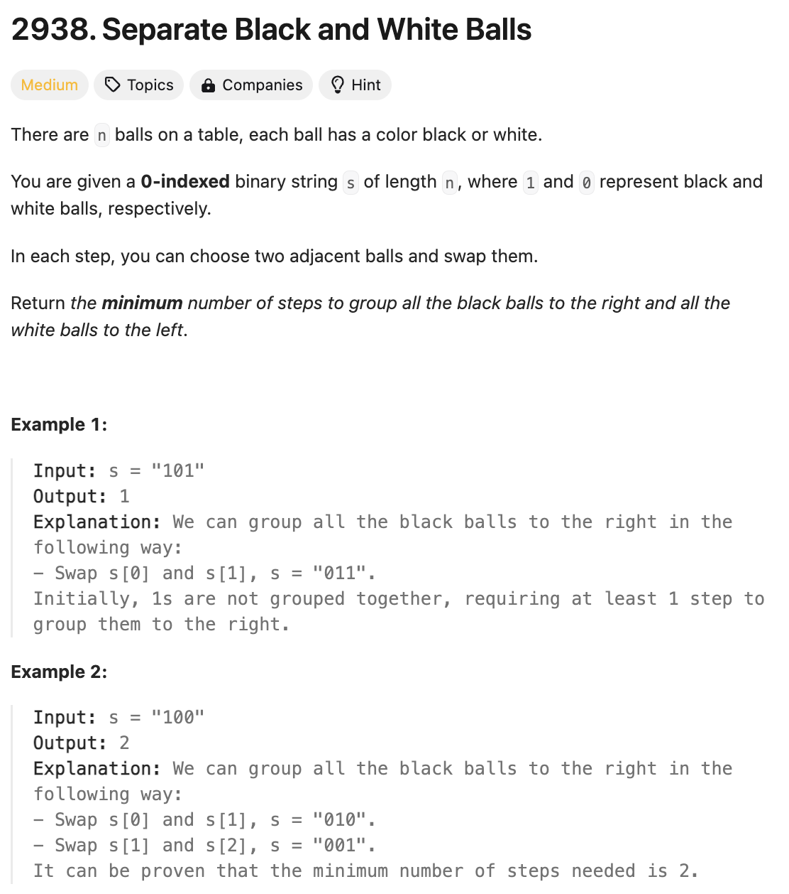

# 문제 설명
이 문제는 흰색 공을 0으로, 그리고 검은 공은 1으로 표시한다. 이때, 연달아 있는 두개 공의 위치를 바꿀 수 있다. 모든 흰공이 왼쪽에 있고, 모든 검은 공이 오른쪽에 있도록 공을 정렬하는데 필요한 최소한의 단계를 구하는 문제이다.



## 풀이 및 해설
이 문제는 지금까지 나타난 검은 공의 수를 세면 된다.  
그러다 흰공이 나타나면, 지금까지 나타난 검은 공의 수를 더해주면 된다.  
이유는 흰공이 나타난 순간, 이전에 있던 모든 검은 공을 오른쪽으로 한 칸씩 이동시켜야 하기 때문이다.

## 풀이
```python
def minimumSteps(self, s: str) -> int:
    steps = 0
    black_balls = 0

    for i,ball in enumerate(s):
        if ball == '1':
            black_balls += 1
        else:
            steps += black_balls
    
    return steps
```

## Complexity Analysis


### 시간 복잡도
- O(n) ; n은 s의 길이

### 공간 복잡도
- O(1) ; 상수만큼의 공간이 필요하다.

## Constraint Analysis
```
Constraints:
1 <= n == s.length <= 10^5
s[i] is either '0' or '1'.
```

# References
- [2938. Separate Black and White Balls](https://leetcode.com/problems/separate-black-and-white-balls/)