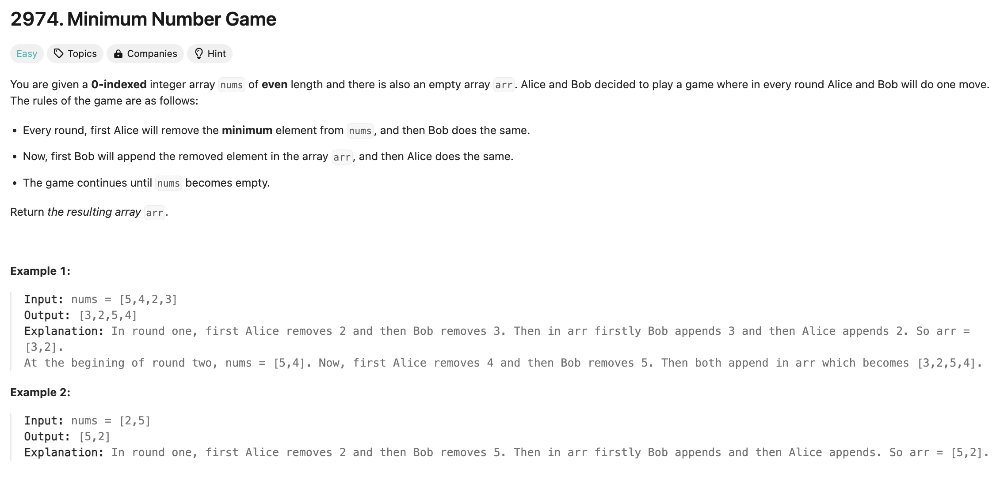

## 문제 설명
배열이 주어졌을 때, 앨리스와 밥이 번갈아가며 가장 작은 숫자를 하나씩 배열에서 없애고, 이후 반대로 밥과 앨리스가 새로운 배열에 순서대로 하나씩 추가한다. 최종 배열을 출력해라.



## 풀이 해설
제일 작은 숫자를 지속적으로 찾아야 함으로서 heap 자료구조를 사용하는게 좋을것 같다. 주어진 num 배열을 우선 heap으로 변환하여, 순차적으로 하나씩 차감하고 새로운 배열에 추가한다.


## 풀이
```python
import heapq

class Solution:
    def numberGame(self, nums: List[int]) -> List[int]:
        heapq.heapify(nums)
        arr = []

        while nums:
            Alice = heapq.heappop(nums)
            if len(nums) > 0:    
                Bob = heapq.heappop(nums)
                arr.append(Bob)
        
            arr.append(Alice)
        return arr
```
## Complexity Analysis


### Time Complexity
- heapq.heapify(min_heap)은 O(N) 시간이 소요된다. 이때 N은 nums 배열에 있는 숫자 갯수다.
- heappop는 O(logN) 시간이 소요된다.
- append는 O(1) 시간이 소요된다.

N에 따라 scaling up이 됨으로 N * (O(logN) + O(1)) = O(NlogN) 시간이 소요된다.


### Space Complexity
- nums 배열에 있는 N개의 숫자에 따른 O(N) 공간이 필요하다.

## Constraint Analysis
```
Constraints:

2 <= nums.length <= 100
1 <= nums[i] <= 100
nums.length % 2 == 0
```

- 시간복잡도는 O(NlogN)이므로, N은 최대 100이다. O(100log100)에 대하여 최악의 경우에 최대 200번의 연산이 필요하다.
- 공간복잡도는 O(N)이다. N은 최대 100이다.

# References
- [LeetCode](https://leetcode.com/problems/minimum-number-game/)
- [Heap Queue](https://docs.python.org/3/library/heapq.html)
