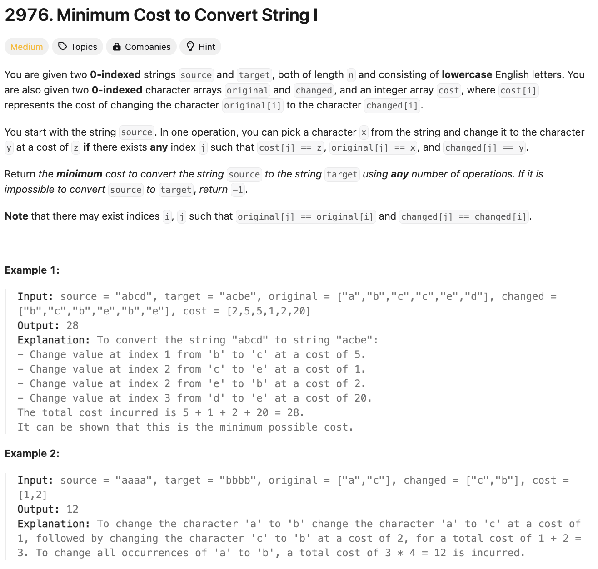
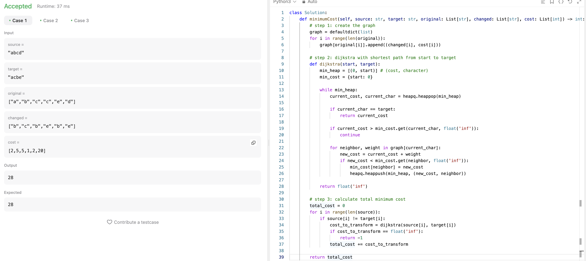
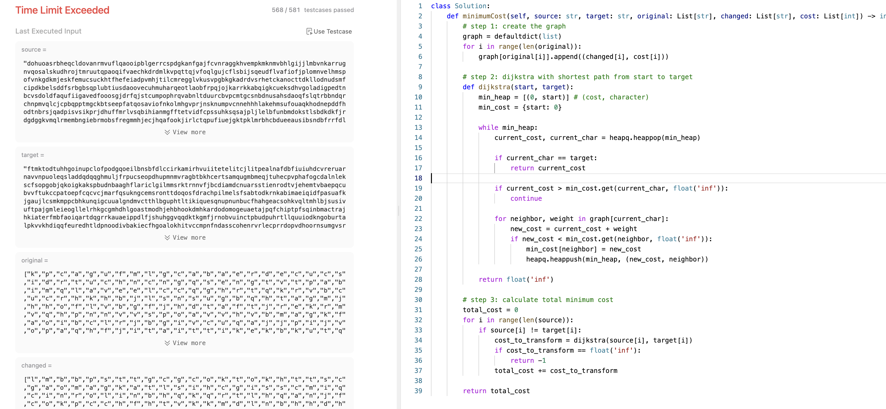
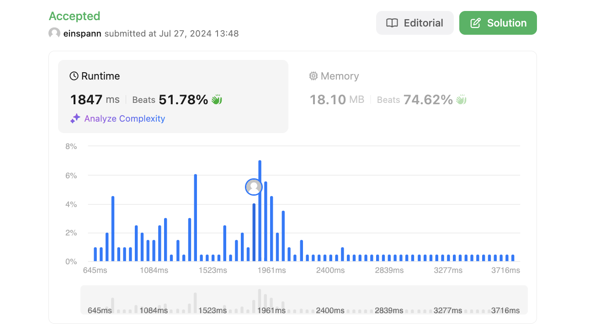

# 문제 설명
문자열을 다른 문자열로 변환하는 최소 비용을 찾는 문제다.



## 시도 1
첫번째 시도는 다익스트라 알고리즘을 사용해봤지만, 시간 초과가 발생했다. 찾아보니, 다익스트라 알고리즘은 입력이 많을 경우 시간 초과가 발생할 수 있다고 한다.




## 풀이

```python
def minimumCost(self, source: str, target: str, original: List[str], changed: List[str], cost: List[int]) -> int:
        # step 1: create the graph
        graph = defaultdict(list)
        for i in range(len(original)):
            graph[original[i]].append((changed[i], cost[i]))

        # step 2: dijkstra with shortest path from start to target
        def dijkstra(start, target):
            min_heap = [(0, start)] # (cost, character)
            min_cost = {start: 0}

            while min_heap:
                current_cost, current_char = heapq.heappop(min_heap)

                if current_char == target:
                    return current_cost

                if current_cost > min_cost.get(current_char, float('inf')):
                    continue

                for neighbor, weight in graph[current_char]:
                    new_cost = current_cost + weight
                    if new_cost < min_cost.get(neighbor, float('inf')):
                        min_cost[neighbor] = new_cost
                        heapq.heappush(min_heap, (new_cost, neighbor))

            return float('inf')

        # step 3: calculate total minimum cost
        total_cost = 0
        for i in range(len(source)):
            if source[i] != target[i]:
                cost_to_transform = dijkstra(source[i], target[i])
                if cost_to_transform == float('inf'):
                    return -1
                total_cost += cost_to_transform

        return total_cost
```

## 풀이 및 해설

## 풀이
- 다익스트라 알고리즘을 사용하지 않고, 플로이드-워셜 알고리즘을 사용했다.
- 플로이드-워셜 알고리즘은 모든 정점에서 모든 정점으로의 최단 경로를 구하는 알고리즘이다.
- 더 자세한 비교를 위해 작성한 포스트 [Floyd-Warshall vs Dijkstra](https://sunghj1118.github.io/algorithm/theory/floydvsdijkstra/)를 참고하세요.

```python
def minimumCost(self, source: str, target: str, original: List[str], changed: List[str], cost: List[int]) -> int:
        # step 1: init the distance matrix
        INF = float('inf')
        dist = [[INF] * 26 for _ in range(26)]
        for i in range(26):
            dist[i][i] = 0

        # step 2: build graph
        for o,c,w in zip(original, changed, cost):
            i, j = ord(o) - ord('a'), ord(c) - ord('a')
            dist[i][j] = min(dist[i][j], w)

        # step 3: floyd-warshall
        for k in range(26):
            for i in range(26):
                for j in range(26):
                    dist[i][j] = min(dist[i][j], dist[i][k] + dist[k][j])

        # step 4: calculate the total cost
        total_cost = 0
        for s, t in zip(source, target):
            if s != t:
                cost = dist[ord(s) - ord('a')][ord(t) - ord('a')]
                if cost == INF:
                    return -1
                total_cost += cost

        return total_cost
```
- 행렬 dist를 26x26으로 초기화한다.
- original, changed, cost를 이용해 그래프를 만든다.
- 이때, original과 changed를 이용해 인덱스를 구하고, cost를 이용해 거리를 구한다.
- 플로이드-워셜 알고리즘을 이용해 모든 정점에서 모든 정점으로의 최단 경로를 구한다.
- source와 target을 비교하며, 다른 문자열이면 거리를 구하고, INF이면 -1을 반환한다.
- total_cost에 거리를 더해 반환한다.

## Complexity Analysis


### 시간 복잡도
- 플로이드-워셜 알고리즘을 사용했기 때문에 시간 복잡도는 O(26^3)이다.
- O(N); N은 source의 길이

### 공간 복잡도
- dist 행렬을 사용했기 때문에 공간 복잡도는 O(1)이다.

## Constraint Analysis
```
Constraints:
1 <= source.length == target.length <= 10^5
source, target consist of lowercase English letters.
1 <= cost.length == original.length == changed.length <= 2000
original[i], changed[i] are lowercase English letters.
1 <= cost[i] <= 10^6
original[i] != changed[i]
```

# References
- [2976. Minimum Cost to Convert String I](https://leetcode.com/problems/minimum-cost-to-convert-string-i/)